# Software Fundamental With Java  

## Software Development Life Cycle (SDLC)
This section demonstrates the Software Development Life Cycle (SDLC) for managing and ensuring the success of a new software project in the software business.
### SDLC Phases

#### 1. Analysis

- **Objective:** Understand and analyze the dimensions of the problem or task.
- **Steps:**
  - Gather requirements from the client.
  - Identify key features and target users.
  - Divide large tasks into smaller components for detailed analysis.

#### 2. Design

- **Objective:** Translate analysis into a plan for implementation.
- **Steps:**
  - Define system architecture, algorithms, and database structures.
  - Conduct Object-Oriented Programming (OOP) and structural design.
  - Specify how components will interact in the system.

#### 3. Implementation

- **Objective:** Transform the design into code.
- **Steps:**
  - Code using the chosen programming language or frameworks.
  - Ensure all SDLC phases are completed for project success.

#### 4. Testing

- **Objective:** Verify functionality and identify errors.
- **Steps:**
  - Begin testing to uncover bugs and issues.
  - Address and fix identified issues promptly.

#### 5. Deployment

- **Objective:** Deploy the project for user access.
- **Steps:**
  - Deploy on servers or platforms like Google Play.
  - Address user-facing issues promptly.

#### 6. Maintenance

- **Objective:** Continuously address user feedback and issues.
- **Steps:**
  - Stay connected to clients and users for feedback.
  - Revisit the SDLC for seamless integration of new features.

### Choosing Your Approach

There are two main approaches to implementing SDLC:

- **Waterfall Model:** Follows a sequential approach, suitable for well-defined and stable requirements.

- **Agile Model:** Allows for flexibility and parallel execution, well-suited for projects with evolving requirements.
Choose the approach that best fits the nature of your project.


## We use simple UML.Like diagrams.
If we'd used pureUML, you'd be seeing something that looks like Java , but with syntax that'sjust plain 1UTfYflf;. So we use a simplified version of UML that doesn't conflict with Java syntax. If you don't already know UML. you won't have to worry about leamingJava and UML at the same time .

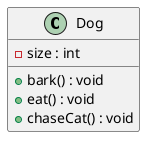

## Java takes you to new places
Java seduced programmers with Its friendly syntax, object-orlented features,memory management, and best of a all-the promise of portability.The lure of write-once/run anywhere Is just too strong.

## The Way Java Works
The goal Is to write one application (in this example, an interactive party Invitation) and have It work on whatever device your friends have .
### Source :
Create a source document. Use an established protocol (In th is case, the Java language).
### Compiler :
Run your document through a source code complier.The complier checks for errors and won't let you compile until It's satisfied that everything will run correctly.
### Output(code) :
The compiler creates a new document, coded into Java bytecode.
Any device capable of running Javawill be able to Interpret translate this file into something It can run .The complied bytecode is platform Independent.
### Virtual Machhines :
Your friends don't have a physical Java Machine, but they all have a
virtual Java machine (implemented In software) running inside their electronic gadgets. The virtual machine reads and runs the bytecode.


## What you'll do in Java
You'll type a source code file, compile It using the Java complier, then run the complied bytecode on a .Java virtual machine.

## A very brief history ofJava
### Java 1.02
250 classes
Slow.
Cute name and logo.
Fun to use. Lots of bugs. Applets are the Big Thing.
### Java 1.1
500 classes A little faster.
More capable, friendlier.
Becoming very popultJr.
Better GUI code.
### Java 2(versions 1.2 .. 1.4)
2300dasses
Much faster.
Can (sometimes) run at native speeds. Serious,
powerful. Comes in three flavors: Micro Edition (J2ME),
Standard Edition (J2SE) and Enterprise Edition (J2EE).
Becomes the langutlge of chola for new enterprise (especially web-based) and mobile applications.
### Java 5.0 (versions 1.5 attd up)
3500 classes
More power, easier to develop with, Besides adding more than a thousand additional classes, Java 5.0 (known as"Tiger"') added major changes to the language itself, making it easier (at least in theory) for programmers and giving it new features that were popular in other languages.


## Q..: I see Java 2 and Java 5.0, but was there a Java 3-.d 4? And why Is It Java 5.0 but not Java 2.0?
The joys of marketing...when the version of Java shifted from 1.1 to 1.2 2, the changes to Java were so dramatic that the marketers decided we needed a whole new "name",so they started calling It Java 2, even though the actual l version of Java was 1.2. But versions 1.3 and 1.4 were still considered Java 2.


## What goes in a source file?
A source code file (with the .java extension) holds one class definition. The class represents a piece of your program, although a very tiny application might need just a single class. The class must go within a pair of curly braces.
```java 
public class Dog{

}
```

## What goes in a class?
A class has one or more methods. In the Dog class, the bark method
will hold instructions for how the Dog should bark. Your methods must be declared inside a class (in other words, within the curly braces ofthe class).
```java 
public class Dog{

    void brak(){
        // implementation
    }

}
```

## What goes In a method?
Within the curly braces of a method, write your instructions
for how that method should be performed. Method code is basically a set ofstatements, and for now you can think of a method
kind of like a function or procedure.
```java 
public class Dog{

    void brak(){
       // statementl;
       // statement2;
    }

}
```

## Anatomy of a class
When the jVM starts running, it looks for the class you give it at the command line. Then it starts looking for a specially-Written method that looks exactly like:
```java 
public static void main (String[]args){
// your code goes here
}
```
Next, theJVM runs everything between the curly braces { }of your main
method. EveryJava application has to have at least one class. and at least one main method (not one main per class;just one main per application)
```java
public class MyFirstApp{
    public static void main (String[]args){
        System.out.println("my name is mahmoud");
    }
}
```
public means : every one can access it 
class means : this is a java keyword to create class 
MyFirstApp : the name of this class 
static means : we will cover this one later 
void means : the return type void means there's no retun value.
main means : the name of method 
String[]args : arguments to the method this method must be given an array of strings and the array will be called args 
System.out.println means : this says print to standard output and every statement Must end in a semicolon .
```
Don't warry about anything right now this is just to get you started 
```

## Writing a class with a main
In Java, everything goes in a class. You'll type your source code file (with a .java extension), then compile it into a new class file (with a .class extension). When you run your program, you're really running a class.
Running a program means telling the Java VIrtual Machine (JVM) to "Load the Hello class, then start executing its main () method. Keep running 'til all the code in main is finished."
The main method is where your program starts running.
No matter how big your program is (in other words, no matter how many classes your program uses), there's got to be a mainO method to get the ball rolling.

## Why does everything have to be In a class ?
Java is an object-oriented(OO) language. It's not Iike the old days when you had steamdriven compliers and wrote one monolithic source file with a file of procedures. 

## Do I have to put a main In every class I write?
Nope .A Java program might use dozens of classes(even hundreds), but you might only have one with a maIn method the one that starts the program running.You might wrIte test classes, though, that have main methods for testing your other classes .

# Statements, Looping, Branching

## What can you say in the main method ?
Once you 're inside main (or any method), the fun begins. You can say all the normal things that you say in most programming languages to make the computer do something.
Your code can tell the JVM to:

- do something :Statements:declaratlons, assignments. method calls etc,
```java
int x 3;
String name = "Dirk";
x = x * 17;
System.out.print("x is " + x);
double d = Math.random();
// this is a comment
```

- do something again and again : Loops=> for and while
```java
while (x > 12){
    x=x-1;
}

for (int x ee 0; x < 10; x = x + 1) {
    System.out.print("x is now II + x");
}
```

- do something under this condition : Branching => if/else  (Tests)
```java
if (x == 10) {
    System.out.print("x mUSt be 10");
}
else {
    System.out.print("x isn't lO ll");
}
if (x < 3) & (name.equals("Dirkll ")){
    System.out.println("Gently");
}
```

## Some Syntax Fun 
- Each statement must end in asemicolon.
```java
x=x+1;
```

- A single line comment begins with two forward slashed .
```java
x=12;
// this comment line
```

- Most white space doesn't mantter.
```java
x             =         3          ;
```

- Classes and methods must be defined within a pair of curly braces.
```java
public void go ( ) {
// amazing code here
}
```

## System.out.print() vs System.out.println()
- System.out.println inserts a newline think of println as printnewline while System.out.print keeps printing to the same line.
- if you want each thing you print out to be on its own line, use println. if you want everything to stick together on one line,use print .

## Know Your Variables
- Variables come in two flavors: primitive and reference.So far you've
used variables In two places-as object state (instance variables), and as local variables (variables declared within a method).Later,we'll use variables as arguments (values sent to a method by the calling code), and as return types (values sent back to the caller of the method).You've seen variables declared as simpie prjmIUve integer values (type int).
- When you think ofJava variables, think of cups. Coffee cups, tea cups,gaint cups that hold d lots and lots of beer, those big cups the popcorn comes in at the movies,cups with curvy, sexy handles, and cups with metallic trim that you learned can never ,ever go in the microwave.
- A variable is just a cup. A container. It holds something.


### Primitive Types
- Type BitDepth Value Range boolean and char, boolean (JVM ..pedfic) true or false, and char 16 bits 0 to 65535
- numeric (all are signed):
    Integer
    byte 8 bits -128 to 127
    short 16 bits -32768 to
    32767
    int 32 bits -2147483648
    to 2147483647
    long 64 bits -huge to huge
    floating point:
        float 32 bits varies
        double 64 bits varies


### Declaring a variable
- Java cares about type. you can't put a Giraffe in a Rabbit variable
- variables must have a type.
- variables must have a name.
```java
// Declaration variable count
int count;
// Primitive declarations with assignments
Int x;
x = 234;
byte b = 89;
boolean isfun = true;
double d = 3456,98;
char c ='f';
int z = x;
boolean IsPunkRock;
isPunkRock= false;
boolean powerOn;
powerOn = IsFun;
long big = 3456789j
float f = 32.5f;  // notic 'f' gotta have that with a float, because java thinks anything with a floating point is a double, unless you use 'f'
```

### You really don't  want to spill that... 
- Be sure the value can fit into the variable.
- You can't put a large value into a small cup.
- The compiler won't let you put a value from a large cup into a small one. But what about the other way-pouring a small cup into a big one ? No problem .
- Basedon what you know about the size and type of the primitive varlables, see if you can figure out which of these are legal and which aren't, We haven't covered all the rules yet, so on some of these you'll have to use your best judgment. Tip: The compiler always erros on the side of safety .
```java
int size = 32; // Work Successfully
boolean isCrazy; // Work Successfully
isCrazy true; // Work Successfully

int x = 24;  // Work Successfully
byte b = x; // Won't work
```

### Back away from that keyword!
you know you need a name and a type for your variables. You already know the primitive types .But what can you we as names? The rules are simple. You can name a class, method, or variable according to the following rules :
- It must start with a letter, underscore U, or dollar algn ($). You can't atart a name with a number.
- After the first character, you can u.. numbers as well. Just don't atart It with a number.
- It can be anything you like, subject to those two rules, Just so long as It Isn't one of Java's reserved words .

### This Table Reserved 
boolean - byte - char - double - float - Int - long - short - public - private - protected - abstract - final - native - static - String - transient - If - else - do - while - switch - case - default - for - break - continue - assert - class - extends - implements - import - instanceof - interface - new - package - super - this - catch - flnally - try - throw - throws - return - void - const - enum ,...
Java's keywords and other reserved words (In no useful order). If you use these for names, the complier will be very, very upset.


### The 3 steps of object declaration, creation and assignment (Reference Variable)
- Declare a reference variable :
    ```java
    Dog myDog;
    ```
    Tells the JVM to allocate space for a reference variable, and names that variable myDog. The reference variable Is, forever. of type Dog.ln other words, a remote control that has buttons to control a Dog, but not a Cat or a Button or a Socket.
- Create an Object :
    ```java
    myDog = new Dog();
    ```
    Tells the JVM to allocate space for a new Dog object on the heap.
- Linke The Object And The Reference :
    ```java
    Dog myDog = new Dog () ;
    ```    
    Assigns the new Dog to the reference variable myDog.ln other words,programs the remote control.
    

### Life on the garbage..collectible heap 
```java
Book b=new Book();
Book c=new Book();
```
- Declare two book reference variables.Create two new Objects to the reference .Assign the Book object to the refernce variable .The Two Book objects are now living on the heap.
references :2 
Objects :2

```java
Book d=c;
```
- Declare a new Book reference variable.Rather than creating a new, third Book object,assign the value of variable c to variable d.But what does th is mean? it's like saying "Take the bits In c,make a copy of them, and stick that copy Into d."
- Both c and d refer to the same object.
- The c and d variables hold two dlfferent copies of the same value. 
references :3 
Objects :2

```java
c = b;
```
- Assign the value of variable b to variable c. Bynow you know what
is means.The bits inside variable at are copied, and that new copy Is stuffed into variable c. Both band c refer to the same object. References:3
Objects : 2

### Life and death on the heap 
```java
Book b = new Book() ;
Book c = new Book() ;
```
- Declare two Book reference variables. Create two new Book objects. Assign the Book objects to the reference variables. The two book objects are now living on the heap.
ActIve References:2
Reachable Objects: 2

```java
b = C;
```
- Assign the value of variable c to variable b. The bits Inside variable c are copied, and that new copy is stuffed Into variable b.Both variables hold identical values.Both band c refer to the same
object. Object 1 is abandoned and eligible for Garbage Collectio(GC).
Active References:2
Reachable Objects: 1
Abandoned Objects: 1
The first object that b referenced, Object 1,has no more references. It's unreachable .

```java
c = null ;
```
- Assign the value nu 11 to variable c. This makes c a null reference, meaning It doesn't refer to anything. But It's still a reference variable, and another Book object can stili be assigned to It. Object 2 still has an active reference (b), and as long as It does, the object Is not eligible for GC.
ActIve References: 1
null References: 1
Reachable Objects: 1
Abandoned Objects: 1

### Declaringg and initializing instance variables
You already know that a variable declaration needs at least a name and a type :
```java
int size;
String name;
```
And you know that you can initialize (assign a value) to the
variable at the same time:
```java
int size = 420;
String name = "Donny"
```
But when you don't initialize an instance variable, what happens when you call a getter method? In other words, what is the value of an instance variable before initialize it?
```java
class PoorDog{

    // decalre two instance variable but don't assign a value
    private int size;
    private String name;

   // What will there return ?
    public int getSize(){
        return size;
    }
    public String getName(){
        return name;
    }
}

public class PoorDogTestDrive{
    public static void main (String[]args){
        PoorDog one = new PoorDog () ; 

        // what do you think?will this even compile ?
        System.out.println("Dog size is " + one.getSize());
        System.out.println("Dog name is " + one.getName());
    }
}
```
- Instance variables always get a default value. If you don't explicitly assign a value to an instance variable, or you don't call a setter method, the instance variable still has a value!
integers 0
floating points 0.0
booleans false
references null

```above code output
 Dog size is 0
 Dog name is null
```

### Comparing Variables (Primitive or references)
Sometimes you want to know iftwo primitives are the same. That's easy enough, just use the = operator. Sometimes you want to know if two reference variables refer to a siogle object ~>n the heap. Easy as well, jusl use the == operator. But sometimes you want to know if two objects are equal. And for that, you need the .equals0 method. The idea of equality for objects depends on the type of object. For example, iftwo different String objects have the same characters (say. "expeditious"), they are meaningfully equivalent, regardless of whether they are two distinct objects on the heap. But what about a Dog? Do you want to treat two Dogs as being equal if they happen to have the same size and weight? Probably not. So whether two different objects should be treated as equal depends on what makes sense for that particular object type .

- To compare two primitives, use the == operator : The = operator can be used to compare two variables of any kind, and it simply compares the bits.
```java
int a=3;
byte b=3;
if(a==b){
    // true 
}
```

- To see If two references are the same (which means they refer to the same object on the heap) use the == operator
```java
Foo a = new Foo();
Foo b = new Foo();
Foo c = a;
if (a == b) { 
    // false
    }
if (a == c){
    // true
    }
if(b == c){
    //false
}    
```

- Use == to compare two primitives, or to see if two references refer to the same object. Use the equals() method to see if two different objects are equal.(Such as two different String objects that both represent the characters In "Fred")


## Looping and looping...
- Java has three standard Looping constructs: While; do-While, and for.
- You'll get the full loop scoop later in the repo, but not for awhile, so let's do while for now.
- The syntax (not to mention logic) is so simple you're probably asleep already. Aslong as some condition is true, you do everything inside the loop block .
- The loop block is bounded by a pair ofcurly braces, so whatever you want to repeat needs to be inside that block .
- The key to a loop is the conditionaltest. in Java, a conditional test is an expression that results in a boolean value-in other words, something that is either true or false .

### Simple boolean tests
- You can do a simple boolean test by checking the value of a variable, using a comparison operator including:
" < (less than) "
" > (greater than) "
" ==(equality) (yes, that's two equals signs) "
- Notice the difference between the assignment operator (a singleequals sign) and the equals operator (two equals signs). Lots of programmers accidentally type = when they want ==. (But not you.)
```java
int x 4; // assign 4 to x
while (x > 3) {
// loop code will run because
// x is greater than 3
x = x-1; // or we'd loop forever
}
int z = 27; 
while (z == 17){
// loop code will not run because
// z is not equal to 17
}
```

### Example of a while loop
```java
public class Loopy {
public static void main (String[] args) {
int x= 1;
System.out.println("Before the Loop");
while (x < 4) {
    System.out.println("In the loop");
    System.out .prlntln("Value of x is " + x);
    x = x + 1;
    }
        System.out.println("This is after the loop");
    }
}
```
```Output
Before the Loop
In the loop
Value of x is 1
In the loop
Value of x i8 2
In the loop
Value of x is 3
This is after the loop
```

### More about for loops
We'll start with the details of for loops, and if you're a C++ programmer, you can just skim these last few pages ..

#### Regular(non-enhanced) for loops
```java
for(int i=0;i<100;i++){
    // implementation
}
```
- What it means in plain English: " Repeat 100 times ."
- How the complier sees It:
    • create a variable I and set It to O.
    • repeat while I is less than 100.
    • at the end of each loop IteratIon, add 1 to I
- Part One: Initialization Use this part to declare and Initialize a variable to use within the loop body. You'll most often use this variable as a counter.You can actually initialize more than one variable here, but we'll get to that later In the book .
- Part Two: boolean test This Is where the conditional test goes Whatever's In there, It must resolve to a boolean value (you know,true or false) .You can have a test" like (x >= 4), or you can even Invoke a method that returns a boolean.
- Part Three: IteratIon expression In this part, put one or more things you want to happen with each trip through the loop. Keep In mind that this stuff happens at the end of each loop.

#### Differenc between for and while loop
A while loop has only the boolean test; It doesn't have a built-in initialization or Iteration expression.A while loop is good when you don't know how many times to loop and just want to keep going while some condition is true.But if you know how many times to loop the length of an array,7 times ,etc ,a for loop is cleaner.
```java
// Example with for loop

for (int i=0;i<8;i++){
    System.out.println(i);
}


// Example with while loop

int i = 0 ;  // we have to declare and initialize the counter
while( i < 8 ){
    System.out.println(i);
    i ++;    // we have to increment the counter 
}
```

#### Pre and Post Increment/Decrement Operator
The shortcut for adding or subtracting 1 from a variable.
```java
X++;
```
Is the same as:
```java
X = X + 1;
```
- They both mean the same thing in this context:
"add 1 to the current value of x" or ·'ncrement x by 1"
- And:
```java
X--;
```
Is the same as:
```java
X = X - 1;
```
- Of course that's never the whole story.The placement of the operator (either before or after the variable) can affect the result. Putting the operator beforethe variable (for example, ++x),
means:'first, increment x by 1,and then use this new value of x."This only matters when the ++x Is part of some larger expression rather than just in a single statement.
```java
int x = 0 ; int z = ++x;
```
produces: X Is 1, z Is 1
But putting the ++ after the x give you a different resuIt:
```java
int x = 0;
int z = x++;
```
- produces: X Is 1, but z Is 0 z gets the value of x and then x is Incremented.

#### The enhanced for loop
Beginning with Java 5.0 (Tiger), theJava language has a second kind of for loop called the enhanced for, that makes it easier to iterate over all the elements in an array or other kinds of collections (you'll learn about other collections in the next chapter). That's really all that the enhanced for gives you-a simpler way to walk
through all the elements in the collection, but since it's the most common use of a for loop, it was worth adding it to the language. We'll revisit the enhanced for loop in the next chapter, when we talk about collections that aren't arrays .
```java
for(String name:nameArray){
    System.out.println(name);
}
```
- What It means In plain English: "For each element in nameArray assign the element to the 'name'varlable, and run the body of the loop."
- How the complier sees It:
    • Create a String variable called name and set It to null.
    • Assign the first value In nameArray to name.
    • Run the body of the loop (the code block bounded by curly braces).
    • Assign the next value In nameArray to name.
    • Repeat while there are stili elements In the array
- *Part One*: Iteration variable declaration Use this part to declare and Initialize a variable to use within the loop body, With each Iteration of the loop. this variable will hold a different element from the collection. The type of this variable must be compatible with the elements in the arrayl For example, you can't declare an lnt Iteration variable to use with a StrlngU array.
- *Part Two*: the actual collection This must be a reference to an array or other collection. Again, don't worry about the other non-array kinds of collections yet-you'll see them in the next chapter.    

### In my other language I can do a boolean test on an Integer.InJava, can I say something like: ?
 ```java
int x = 1;
while(x){}
```
?

No.A boolean and an integer are not compatible types In Java.Since the result of a conditional test must be a boolean, the only varIable you can directly test (without using a comparison operator) Is a boolean. For example,
you can say:
```java
boolean isHot = true;
while (isHot) {}
```


### Looping Bullet Points 
- The assignment operator Isone equals sign =
- The equals operator uses two equals signs ==
- A while loop runs everything within its block (defined by curly
braces) as long as the conditional test Is true.
- If the conditional test isfa1S8, the while loop code block won't run, and execution will move down tothe code Immediately after the loop block.
- Put a boolean test Inside parentheses:
while (x = 4) { }


## Conditional branching
In java, an if test is basically the same as the boolean test in a while loop-except  t instead ofsaying, ~UJhile there's still beer.,",
you'll say "if there's still beer".
```java
class IfTest {
public static void main (String[] args) {
int x = 3;
if (x == 3){
    System.out.println("x must be 3 ") ;
    }
    System.out.println("This runs no matter what");
}   
}
```
```Output
%java IfTest
x must be 3
This runs no matter what 
```
- The code above executes the line that prints "x must be 3" only if the condition (x is equal to 3) is true.Regardless of whether it's true, though, the line that prints, "This runs no matter what" will run. So depending on the value of x; either one statement or two will print out .
- But we can add an else to the condition, so that we can say something like, "If there's still beer, keep coding, else (otherwise) get more beer, and then continue on..."
```java
class IfTest {
public static void main (String[] args) {
int x = 3;
if (x == 3){
    System.out.println("x must be 3 ") ;
    System.out.println("This runs no matter what");
}
else {
    System.out.println("x is NOT 3");
}
System.out.println("This runs no matter what");
    }   
}
```
```Output
x is Not 3
This runs no matter what
```

## An array is like a tray of variables 
- Declare an int array verinble. An array variable is a remote control to an array object.
```java
int[] nums;
```
- Create a new int array with a length of 7 and assign it to the previously declared int[] variable nums.
```java
nums = new int[7] ;
```
- Give each element in the array an int value. Remember, elements in an int array are just int variables.
```java
nums[0] = 6;
nums[l] = 19;
nums[2] = 44;
nums[3] = 42;
nums[4] = 10;
nums[5] = 20;
nums[6] = 1;
```
- Notice that the array itself is an object,even though the 7 element are primitives
- Arrays are always objects, whether they're declared to bold primitives or object references. But you can have an array object that's declared to hold primitive values. In other words, the array object can have elements which are primitives. but the array itself is nevera primitive, Regardless of what the array holds, the array itself is always an object!.
- Make an array of Dogs
    *Declare a Dog array variable :*
    ```java
    Dog[] pets;
    ```

    *Create a new Dog array with a length of 7, and assign it to the previously-declared Dog [] variable pets*
    ```java
    pets = new Dog[7];
    ```

    *What's missing?Dogs! We have an array of Dog reference, but no actual Dog objects*

    *Create new Dog objects, and assign them to the array elements.Remember, elements in a Dog array are just Dog reference variables. We still need Dogs!*
    ```java
    pets[0] = new Dog();
    pets[l] = new Dog();
    ```

## Variables Bullet Points 
• Variables come in two flavors: primitive and reference.
• Variables must always be declared with aname and a type.
• A primitive variable value isthe bits representing the value (5,'a', true, 3.1416, etc.).
• A reference variable value is the bits representing a way to get to an object on the heap.
• A reference variable is like a remote control. Using the dot operator (.) on a reference variable islike pressing a button on the remote control to access amethod orinstance variable.
• A reference variable has a value of null when it isnot referencing any object
• An array is always an object, even if the array is declared to hold primitives" There isno such thing as a primitive array,only an array that holds primitives.

## Methods 
In Java, a method is a block of code that performs a specific task and is defined within a class or interface. Methods are used to organize code into reusable units and facilitate modular programming.

*The basic syntax for defining a method in Java is as follows:*
```java
modifier returnType methodName(parameterList) {
    // method body
}
``` 
### Let's break down the components of a method definition:
- Modifier: It specifies the access level or other properties of the method. Common modifiers include public, private, protected, static, final, etc.

- Return Type: It specifies the type of value that the method returns. If a method does not return any value, the return type is specified as void.

- Method Name: It is the name given to the method. It follows the same rules as variable names in Java.

- Parameter List: It is a list of parameters (inputs) that the method accepts. Parameters are variables that receive values when the method is called. If a method takes no parameters, the parentheses are left empty.

- Method Body: It is enclosed within curly braces {} and contains the statements that define what the method does. The actual implementation of the method's functionality is written in the method body.

### You can send things to methods
Just as you expect from any programming language, you aU1 pass values into your methods. You might, for example, want to tell a Dog object how many times to bark by calling:
```java
d.bark(3) ;
```
Depending on your programming background and personal preferences,you might use the term arguments or perhaps paramet.ers for the values passed in to a method. Although there are formal computer science distinctions that people who wear lab coats and who will almost certainly not read this book.make. we have bigger fish to fry in this book. So you can call them whatever you like (arguments, donuts, hairballs, etc.) but we're doing it like this:
*A method parameters. A caller passes arguments.*
Arguments are the things you pass into the methods. An argument (a value like 2, "Faa", or a reference to a Dog) lands face-down into a... wait for it..parameter. And a parameter is nothing more than a local variable. A variable with a type and a name, that can be used inside the body of the method But here's the"important part: If a method takes a parameter, you must pass it something. And that something must be a value of the appropriate type .

- Example 
    ```java
    void bark (int numO arks){
        while (numOfBarks > 0){
            System.out.println("ruff");
            numOfBarks = numOfBarks - 1;
        }
    }
    ```
    ```java
    Dog d = new Dog() ;
    d.bark(3) ;
    ```
    • Call the bark method on the Dog reference, and pass in the value 3 (as the argument to the method).
    • The bits representing the int value 3 are delivered into the bark method.
    • The bits land in the numOfBarks parameter (an int-stzec variable)
    • Use the numOfBarks parameter as a variable in the method code.

### You can get things back from a Method.
- Methods can return values. Every method is declared with a return type but until now we've made all ofour methods with a void return type, which means they don't give anything back.
```java
void go(){

}
```
- But we can declare a method to give a specific type of value back to the caller such as :
```java
int giveNumber(){
    return 59;
}
```
- If ypu declare a method to return a value, you must return a value e ofthe declared rypel (Or a value that is cmpatible with the declared type.We'll get into that more when we talk about polymorphism).
- The compiler won't let you return the wrong type of thing.

### You can send more than one thing to a Method
Methods can have multiple parameters. Separate them with commas when you declare them, and separate the arguments with commas when you pass them. Most importantly, ifa method has parameters, you must pass arguments of the right type and order.
- Calling a two-parameter Method, and sending it two arguments.
```java
void takeTwo(int x,int y){
    int z =x+y;
    Systam.out.prinUn ("Total. is " + z);
}
```
- You can pass variables into a method,as long as the variable type matches the parameter type.
```call Method
takeTwo(12,34)
```

### Java is pass...by...value. *That means pass-by-copy.*
- Declare an int variable and assign it the value '7. The bit pattern for 7 goes into the variable named x.
```java
int x=7;
```

- Declare a method with an int parameter named z.
```java
void go (int z){

}
```

- Call the go method with its name, passing the variable x as the argument.The bits in x are copied, and the copy lands in z.
```java
go(x);
```

- Change the value of z inside V the method. The value of x doesn't change The argument passed to the z parameter was only a copy of x.The method can't --- change the bits that were in the calling variable x.


# A Trip to Objectville 
I was told there would be objects. In chapter 1 we put all of our code in the main() method.That's not excatly object-oriented. in fact that's not object-oriented at all. well, we did use a few objects,like the String Array for the Phrase-O-Matic,but we didn't actually develop any of our own object types.So new we've got to leave that procedural world behinf get the heck out of Main(),and start making some objects of our own. we'll look at what makes object-oriented (OO) development in java so much fun.We'll look at the difference between a class and an object.We'll look at how objects can give you a better life.

## What do you like about OO?
- It helps me design in a more natural way. Things have a way of evolving .
- Not messing around with code I’ve already tested, just to add a new feature .
- I like that the data and the methods that operate on that data are together in one class.
- Reusing code in other applications. When I write a new class, I can make it fl exible enough to be used in something new, later.

## Thinking about objects
When you design a class, think about the objects that will be created from that class type. Think about:
- things the object knows
- things the object does

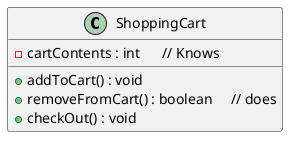
- Things an object knows about itself are called Instance Variable.They represent an object's state (the data),and can have unique values for each object of that type.
- Things an object can do are called Methods.
- When you design a class,you think about the data an object will need to know about itself,and you also design the methods that operate on that data.
- It's common for anaobject to have methods that read or write the values of the instance variables.

## What’s the difference between a class and an object?
- A class is not an object.(but it’s used to construct them).
- A class is a blurPrint for an object.
- It tells the vertual machine how to make an object of that particular type.
- Each object made from that class can have its own values for the instance variables of that class.

## Making your first object
So what does it take to create and use an Object? you need two classes. One class foe the type of object you want to use (Dog,AlarmClock,Television,etc.)and another class to test youe new class.The tester class is where ypu put the main method,and in that main() method you create and access objects of your new class type.

- 1 Write Your Class 
```java
class Dog {
 int size;        // instance variable 
 String breed;   // instance variable 
 String name;   // instance variable 

 void bark() {    // a Method
 System.out.println("Ruff! Ruff!");
 }
}
```
- 2 Write a tester (TestDrive) class
```java
class DogTestDrive {
 public static void main (String[] args) {
 // Dog test code goes here
 }
}
```
- 3 In your tester, make an object and access the object’s variables and methods .
```java
class DogTestDrive {
 public static void main (String[] args) {
 Dog d = new Dog();
 d.size = 40;  // to access an object data use a Dot Operator (.)
 d.bark();
 }
}
```

## Dot Operator (.)
The dot operator (.) gives you access to an object's state and behavior (instance variables and methods).
```java
// make a new object 
Dog d=new Dog();
// tell it to bark by using the dot operater on the variable d to call bark method 
d.bark();
// set its size using the dot operator 
d.size=40;
```

## Controlling your Dog object
You know how to declare a primitive variable and assign it a
value . But now what about non-primitive variables? In other
words, what about objects?
- There Is actually no such thing as an object variable.
- There's only an object reference variable.
- An object reference variable holds bits that represent a way to access an object.
- It doesn't hold the object Itsetf, but It holds something like a pointer. Or an address.
- You use the dot operator (.) on a reference variable 10 say, "use the thing before the dot to get me the thing afterthe dot." For example
```java
myDog.bark() ;
```
means, "use the object referenced by the variable myDog to invoke the bark() method." When you use the dot operator on an object reference variable, think of it like pressing a button on the remote control for that object.
- Think of a Dog reference variable as a Dog remote control you use it to get the object to be do something (invoke methods).

## An object referet1ce is just another variable value
Something that goes In a cup.Only this time, the value 15 a remote control.
- Primitive Variable :
    byte x = 7 ;
    this bits representing 7 go into variable.(00000111)
- Reference Variable :
    Dog myDog = new Doq() ;
    This bits representing a way yo get to the Dog object go into the variable .
    The Dog Object itself doesn't go into the variable .


## Making and testing Movie objects
```java
class Movie {
 String title;
 String genre;
 int rating;
 void playIt() {
 System.out.println(“Playing the movie”);
 }
}
public class MovieTestDrive {
 public static void main(String[] args) {
 Movie one = new Movie();
 one.title = "Gone with the Stock";
 one.genre = "Tragic";
 one.rating = -2;
 Movie two = new Movie();
 two.title = "Lost in Cubicle Space";
 two.genre = "Comedy";
 two.rating = 5;
 two.playIt();
 Movie three = new Movie();
 three.title = "Byte Club";
 three.genre = "Tragic but ultimately uplifting";
 three.rating = 127;
 }
}
```

## The two uses of main:
- to Test youe real class
- to Lunch/Start your java application 

## OOP Bullet Points 
- Object-oriented programming lets you extend 
a program without having to touch previously tested, working code.
- All Java code is defined in a class. 
- A class describes how to make an object of that class type. A class is like a blueprint .
- An object can take care of itself; you don’t have to know or care how the object does it.
- An object knows things and does things.
- Things an object knows about itself are called instance variables. They represent the state of an object.
- Things an object does are called methods. They represent the behavior of an object.
- When you create a class, you may also want to create a separate test class which you’ll use to create objects of your new class type.
- At runtime, a Java program is nothing more than objects ‘talking’ to other objects.


## Better Living in Objectville (inheritance and polymorphism)
- Plan your programs with the future in mind.If there were a way to write Java code such that you could take more vacations, how much would It be worth to you? What if you could write code that someone else could extend, easily? And if you could write code that was flexible, for those pesky last-minute spec changes, would that be something you're interested In?Then this is your lucky day.

### The power of inheritance :

- I looked at what all four classes have in common .

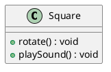

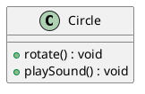

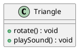

- There're Shapes, and they all rotate and plavSound. So I abstracted out the common features and put them into a new class called Shape.
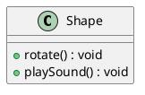

- Then i linked the other four shape classes tp the new shape class,in a relationship called inheritance .
*SuperClass*


*SubClasses*
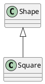

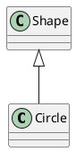

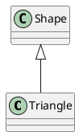

- You can read this as, "Square Inherits from Shape" ,"Circle Inherits from Shape", and so on. I removed rotate() and playSound() from the other shapes, so now there's only one copy to maintain.
- The.Shape class is called the Superclass of the other four classes. The other four are the subclasses of Shape. The Subclasses Inherit the methods of the superclass. In other words. If the Shape class has the functianality, then the subclasses automatically gat that same functionality .

#### Understanding Inheritance
- When you design with inheritance, you put common code in a class and then tell other more specific classes that the common (more abstract) class is their superclass.When one class inherits from another, the subclass inherits from the superclass.
- In Java, we say that the subclass extends the superclass. An inheritance relationship means that the subclass inherits the members of the superclass, When we say "members of a class" we mean the instance variables and methods .
- For example, if PantherMan is a subclass of SuperHero, the PantherMan class automatically inherits the instance variables and methods common to all superheroes including suit, tights specialPower, useSpecialPower() and so on.But the PantherMan subclass can add new methods and instance variables of its own, and it can override the methods it inherits fro:m the superclass SuperHero.

- *SuperClass*
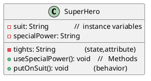

- *SubClasses*  
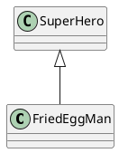
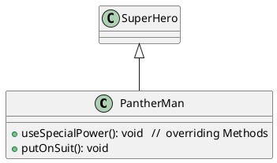

- FriedEggMan doesn't need any behavior that's unique,so he doesn't override any methods. The methods and instance variables in SuperHero are sufficient.PanthenMan, though, has specific requirements for his suit and special powers, so useSpecialPower () and putOnSuit () are both overridden in the PantherMan class.
- Instance variables are not overridden because they don't need to be. They don't define any special behavior, so a subclass can give an inherited instance variable any value it chooses.

#### An Inheritance example :
```java
public class Doctor{
    boolean worksAtHospital;
    void treatPatient(){
        // perform a checkup
    }
}

public class FamilyDoctor extends Doctor{
    boolean makeHouseCalls;
    void giveAdvice(){
        //give homespun advice
    }
}

public class Surgeon extends Doctor{
    void treatPatient(){
        // perform surgery
    } 
    void makeIncision(){
        //make incision (yikes!)
    }
}
```

#### Using IS-A and HAS-A
- Remember that when one class inherits from another, we say that the subclass extends the superclass. When you want to know if one thing should extend another, apply the IS-A test, Triangle IS-A Shape, yeah, that works. Cat IS-A Feline, that works too .Surgeon IS-A Doctor, still good.Tub extends Bathroom, sounds reasonable.
Until you apply the IS-A test.
- To know if you've designed your types correctly, ask, "Does it make sense to say type X IS-A type Y?" If it doesn't, you know there's something wrong with the design, so ifwe apply the IS-A test, Tub IS-A Bathroom is definitely false.
- What if we reverse it to Bathroom extends TUb? That still doesn't work.,Bathroom IS-AvTub doesn't work.
- Tub and Bathroom are related, but not through inheritance. Tub and Bathroom are joined by a HAS-A relationship. Does it make sense to say "Bathroom HAS-A TUb"? If yes, then it means that Bathroom has a Tub instance variable. In other words, Bathroom has a reference to a Tub, but Bathroom does not extend Tub and vice-versa.

#### But wait! There's More!
The IS-A test works anywhere in the inheritance tree. If your inheritance tree is well-designed, the IS-Atest should make sense when you ask any subclass if it IS-A any of it IS su pertypes.
- If class B extends class A, class B IS-A class A.This is true anywhere in the inheritance tree. If class C extends class B, class C passes the IS-A test for both B and A.

#### How do you know if you've got your inheritace right?
Keep in mind that the inheritance IS-A relationship works in only one directionl !
- Triangle IS-AShape makes sense, so you can have Triangle extend Shape. But the reverse-Shape IS-A Triangle-does not make sense, so Shape should not extend Triangle. Remember that the IS-A relationship implies that if X IS-A y. then X can do anything a Y can do (and possibly more).

#### Access levels control
- public members are Inherited
- private members are not Inherited

#### Inheritance Bullet Points
• A subclass extends a superclass.
• A subclass Inherits all public Instance variables and methods of the superclass, but does not Inherit the private Instance variables and methods of the superclass,
• Inherited methods can be overridden; instance variables cannot be overridden (although they can be redefined in the subclass, but that's not the same thing, and there's almost never a
need to do it)
• Use the IS-A test to verify that your inheritance hierarchy is valid. If X extends Y,then X IS-A Y must make sense.
• The IS-A relationship works In only one direction. A Hippo is an Animal. but not all Animals are Hippos.
• When a method is overridden ina subclass, and that method is Invoked on an instance of the subclass, the overridden version of the method is called. (The lowest one wins.)
• If class B extends A, and C extends B, class B IS-A class A, and class C IS-A class B, and class C also IS-A class A .

#### So what does all this Inheritance really buy you?
- You avoid duplicate code.Put common code in one place, and let the subclasses inherit that code from a superclass . When you want to change that behavior, you have to modify it in only one place,and everybody else (i.e, all the subclasses) see the change .
- You define a common protocol for a group of classes.


### The power of polymorphism
- With polymorphism, you can write code that doesn't have to change when you introduce new subclass types Into the program.
- It refers to the ability of a single function, method, or operator to operate on different types of data or objects. In other words, polymorphism allows objects of different types to be treated as objects of a common type.

#### Types of Polymorphism
1. *Compile-time (Static) Polymorphism*
- Method Overloading: Multiple methods in the same class with the same name but different parameter lists.
  ```java
  public class Calculator {
      public int add(int a, int b) {
          return a + b;
      }

      public double add(double a, double b) {
          return a + b;
      }
  }
  ```
2. *Run-time (Dynamic) Polymorphism*
- Method Overriding: A subclass provides a specific implementation of a method already defined in its superclass..
```java
 Superclass
public class Animal {
    public void makeSound() {
        System.out.println("Some generic sound");
    }
}

// Subclass
public class Dog extends Animal {
    @Override
    public void makeSound() {
        System.out.println("Woof! Woof!");
    }
}
  ```

#### Keepingg the contract: rules for overriding
When you override a method from a supercIass, you're agreeing to fulfill the contract. The contract that says. for example, I take no
arguments and I return a boolean. In other words, the arguments and return types of your overriding method must look to the outside world exactly like the overridden method in the superclass .
- Arguments must be the same, and return types must be compatible.
- The method can't be less accessible
  
#### Overloading a Method
Method overloading is nothing more than having two methods with the same name but different argument lists. Period. There's no polymorphism involved with overloaded methods!.It has nothing to do with inheritance and polymorphism. An overloaded method isNoT the same as an overridden method .
- The return types can be different.
- You can't change only the return type.
- You can vary the access levels in any direction.


