# Software Development Life Cycle (SDLC)
This section demonstrates the Software Development Life Cycle (SDLC) for managing and ensuring the success of a new software project in the software business.
## SDLC Phases

### 1. Analysis

- **Objective:** Understand and analyze the dimensions of the problem or task.
- **Steps:**
  - Gather requirements from the client.
  - Identify key features and target users.
  - Divide large tasks into smaller components for detailed analysis.

### 2. Design

- **Objective:** Translate analysis into a plan for implementation.
- **Steps:**
  - Define system architecture, algorithms, and database structures.
  - Conduct Object-Oriented Programming (OOP) and structural design.
  - Specify how components will interact in the system.

### 3. Implementation

- **Objective:** Transform the design into code.
- **Steps:**
  - Code using the chosen programming language or frameworks.
  - Ensure all SDLC phases are completed for project success.

### 4. Testing

- **Objective:** Verify functionality and identify errors.
- **Steps:**
  - Begin testing to uncover bugs and issues.
  - Address and fix identified issues promptly.

### 5. Deployment

- **Objective:** Deploy the project for user access.
- **Steps:**
  - Deploy on servers or platforms like Google Play.
  - Address user-facing issues promptly.

### 6. Maintenance

- **Objective:** Continuously address user feedback and issues.
- **Steps:**
  - Stay connected to clients and users for feedback.
  - Revisit the SDLC for seamless integration of new features.

## Choosing Your Approach

There are two main approaches to implementing SDLC:

- **Waterfall Model:** Follows a sequential approach, suitable for well-defined and stable requirements.

- **Agile Model:** Allows for flexibility and parallel execution, well-suited for projects with evolving requirements.
Choose the approach that best fits the nature of your project.


__________________________________________________________________________________________

# Software Fundamental With Java (Chapter 1. Java Primer) 
## Java takes you to new places
Java seduced programmers with Its friendly syntax, object-orlented features,memory management, and best of a all-the promise of portability.The lure of write-once/run anywhere Is just too strong.

## The Way Java Works
The goal Is to write one application (in this example, an interactive party Invitation) and have It work on whatever device your friends have .
### Source :
Create a source document. Use an established protocol (In th is case, the Java language).
### Compiler :
Run your document through a source code complier.The complier checks for errors and won't let you compile until It's satisfied that everything will run correctly.
### Output(code) :
The compiler creates a new document, coded into Java bytecode.
Any device capable of running Javawill be able to Interpret translate this file into something It can run .The complied bytecode is platform Independent.
### Virtual Machhines :
Your friends don't have a physical Java Machine, but they all have a
virtual Java machine (implemented In software) running inside their electronic gadgets. The virtual machine reads and runs the bytecode.


## What you'll do in Java
You'll type a source code file, compile It using the Java complier, then run the complied bytecode on a .Java virtual machine.

## A very brief history ofJava
### Java 1.02
250 classes
Slow.
Cute name and logo.
Fun to use. Lots of bugs. Applets are the Big Thing.
### Java 1.1
500 classes A little faster.
More capable, friendlier.
Becoming very popultJr.
Better GUI code.
### Java 2(versions 1.2 .. 1.4)
2300dasses
Much faster.
Can (sometimes) run at native speeds. Serious,
powerful. Comes in three flavors: Micro Edition (J2ME),
Standard Edition (J2SE) and Enterprise Edition (J2EE).
Becomes the langutlge of chola for new enterprise (especially web-based) and mobile applications.
### Java 5.0 (versions 1.5 attd up)
3500 classes
More power, easier to develop with, Besides adding more than a thousand additional classes, Java 5.0 (known as"Tiger"') added major changes to the language itself, making it easier (at least in theory) for programmers and giving it new features that were popular in other languages.


## Q..: I see Java 2 and Java 5.0, but was there a Java 3-.d 4? And why Is It Java 5.0 but not Java 2.0?
The joys of marketing...when the version of Java shifted from 1.1 to 1.2 2, the changes to Java were so dramatic that the marketers decided we needed a whole new "name",so they started calling It Java 2, even though the actual l version of Java was 1.2. But versions 1.3 and 1.4 were still considered Java 2.


## What goes in a source file?
A source code file (with the .java extension) holds one class definition. The class represents a piece of your program, although a very tiny application might need just a single class. The class must go within a pair of curly braces.
```java 
public class Dog{

}
```

## What goes in a class?
A class has one or more methods. In the Dog class, the bark method
will hold instructions for how the Dog should bark. Your methods must be declared inside a class (in other words, within the curly braces ofthe class).
```java 
public class Dog{

    void brak(){
        // implementation
    }

}
```

## What goes In a method?
Within the curly braces of a method, write your instructions
for how that method should be performed. Method code is basically a set ofstatements, and for now you can think of a method
kind of like a function or procedure.
```java 
public class Dog{

    void brak(){
       // statementl;
       // statement2;
    }

}
```

## Anatomy of a class
When the jVM starts running, it looks for the class you give it at the command line. Then it starts looking for a specially-Written method that looks exactly like:
```java 
public static void main (String[]args){
// your code goes here
}
```
Next, theJVM runs everything between the curly braces { }of your main
method. EveryJava application has to have at least one class. and at least one main method (not one main per class;just one main per application)
```java
public class MyFirstApp{
    public static void main (String[]args){
        System.out.println("my name is mahmoud");
    }
}
```
public means : every one can access it 
class means : this is a java keyword to create class 
MyFirstApp : the name of this class 
static means : we will cover this one later 
void means : the return type void means there's no retun value.
main means : the name of method 
String[]args : arguments to the method this method must be given an array of strings and the array will be called args 
System.out.println means : this says print to standard output and every statement Must end in a semicolon .
```
Don't warry about anything right now this is just to get you started 
```

## Writing a class with a main
In Java, everything goes in a class. You'll type your source code file (with a .java extension), then compile it into a new class file (with a .class extension). When you run your program, you're really running a class.
Running a program means telling the Java VIrtual Machine (JVM) to "Load the Hello class, then start executing its main () method. Keep running 'til all the code in main is finished."
The main method is where your program starts running.
No matter how big your program is (in other words, no matter how many classes your program uses), there's got to be a mainO method to get the ball rolling.

## Why does everything have to be In a class ?
Java is an object-oriented(OO) language. It's not Iike the old days when you had steamdriven compliers and wrote one monolithic source file with a file of procedures. 

## Do I have to put a main In every class I write?
Nope .A Java program might use dozens of classes(even hundreds), but you might only have one with a maIn method the one that starts the program running.You might wrIte test classes, though, that have main methods for testing your other classes .

## Getting Started
- Building data structures and algorithms requires that we communicate detailed instructions to a computer. An excellent way to perform such communication is using a high-level computer language, such as Java.
-  In this chapter, we provide an overview of the Java programming language, and we continue this discussion in the next chapter, focusing on object-oriented design principles.
- This book does not provide a complete description of the Java language (there are numerous language references for that purpose), but it does introduce all aspects of the language that are used in code fragments later in this book.
- We begin our Java primer with a program that prints “Hello Universe!” on the screen,
```java
public class Universe{
    public static void main(String[]args){
        System.out.println("Hello Universe!");
    }
}
```
- In Java, executable statements are placed in functions,known as methods, that belong to class definitions. The Universe class, in our first example, is extremely simple; its only method is a static one named main, which is the first method to be executed when running a Java program. Any set of statements between the braces “{” and “}” define a program block. Notice that the entire Universe class definition is delimited by such braces, as is the body of the main method.The name of a class, method, or variable in Java is called an identifier, which can be any string of characters as long as it begins with a letter and consists of letters, numbers, and underscore characters (where “letter” and “number” can be from
any written language defined in the Unicode character set). We list the exceptions to this general rule for Java identifiers in next Table :
- *Reserved Words*:-
abstract- default- goto- package- synchronized- assert- do- if private- this- boolean- double- implements- protected- throw- break- else- import- public- throws- byte- enum- instanceof- return- transient- case- extends- int- short- true- catch false- interface- static- try -char- final- long- strictfp- void- class- finally- native- super- volatile-const- float- new- switch- while-continue- for- null.

### Comments 
- In addition to executable statements and declarations, Java allows a programmer to embed comments, which are annotations provided for human readers that are not processed by the Java compiler. Java allows two kinds of comments: inline comments and block comments. Java uses a “//” to begin an inline comment, ignoring everything subsequently on that line. For example:
```java
// This is an inline comment.
```
- While inline comments are limited to one line, Java allows multiline comments
in the form of block comments. Java uses a “/*” to begin a block comment and a
“*/” to close it. For example:
```java
/*
* This is a block comment.
*/
```
## What can you say in the main method ?
Once you 're inside main (or any method), the fun begins. You can say all the normal things that you say in most programming languages to make the computer do something.
Your code can tell the JVM to:

- do something :Statements:declaratlons, assignments. method calls etc,
```java
int x 3;
String name = "Dirk";
x = x * 17;
System.out.print("x is " + x);
double d = Math.random();
// this is a comment
```

- do something again and again : Loops=> for and while
```java
while (x > 12){
    x=x-1;
}

for (int x ee 0; x < 10; x = x + 1) {
    System.out.print("x is now II + x");
}
```

- do something under this condition : Branching => if/else  (Tests)
```java
if (x == 10) {
    System.out.print("x mUSt be 10");
}
else {
    System.out.print("x isn't lO ll");
}
if (x < 3) & (name.equals("Dirkll ")){
    System.out.println("Gently");
}
```

## Some Syntax Fun 
- Each statement must end in asemicolon.
```java
x=x+1;
```

- A single line comment begins with two forward slashed .
```java
x=12;
// this comment line
```

- Most white space doesn't mantter.
```java
x             =         3          ;
```

- Classes and methods must be defined within a pair of curly braces.
```java
public void go ( ) {
// amazing code here
}
```

## System.out.print() vs System.out.println()
- System.out.println inserts a newline think of println as printnewline while System.out.print keeps printing to the same line.
- if you want each thing you print out to be on its own line, use println. if you want everything to stick together on one line,use print .

## Base Types
- For the most commonly used data types, Java provides the following *base types*(also called *primitive types*):
    boolean a boolean value: true or false
    char 16-bit Unicode character
    byte 8-bit signed two’s complement integer
    short 16-bit signed two’s complement integer
    int 32-bit signed two’s complement integer
    long 64-bit signed two’s complement integer
    float 32-bit floating-point number (IEEE 754-1985)
    double 64-bit floating-point number (IEEE 754-1985)

- A variable having one of these types simply stores a value of that type. Integer constants, like 14 or 195, are of type int, unless followed immediately by an ‘L’ or ‘l’, in which case they are of type long. Floating-point constants, like 3.1416 or 6.022e23, are of type double, unless followed immediately by an ‘F’ or ‘f’, in which case they are of type float.    

- Declarations and initializations of several base-type variables:
```java
boolean flag = true;
boolean verbose, debug; // two variables declared, but not yet initialized
char grade = 'A';
byte b = 12;
short s = 24;
int i, j, k = 257; // three variables declared; only k initialized
long l = 890L; // note the use of ”L” here
float pi = 3.1416F; // note the use of ”F” here
double e = 2.71828, a = 6.022e23; // both variables are initialized
```

- Variables declared locally within a block of code must be initialized before they are first used.


## Know Your Variables
- Variables come in two flavors: primitive and reference.So far you've
used variables In two places-as object state (instance variables), and as local variables (variables declared within a method).Later,we'll use variables as arguments (values sent to a method by the calling code), and as return types (values sent back to the caller of the method).You've seen variables declared as simpie prjmIUve integer values (type int).
- When you think ofJava variables, think of cups. Coffee cups, tea cups,gaint cups that hold d lots and lots of beer, those big cups the popcorn comes in at the movies,cups with curvy, sexy handles, and cups with metallic trim that you learned can never ,ever go in the microwave.
- A variable is just a cup. A container. It holds something.


### Primitive Types
- Type BitDepth Value Range boolean and char, boolean (JVM ..pedfic) true or false, and char 16 bits 0 to 65535
- numeric (all are signed):
    Integer
    byte 8 bits -128 to 127
    short 16 bits -32768 to
    32767
    int 32 bits -2147483648
    to 2147483647
    long 64 bits -huge to huge
    floating point:
        float 32 bits varies
        double 64 bits varies


### Declaring a variable
- Java cares about type. you can't put a Giraffe in a Rabbit variable
- variables must have a type.
- variables must have a name.
```java
// Declaration variable count
int count;
// Primitive declarations with assignments
Int x;
x = 234;
byte b = 89;
boolean isfun = true;
double d = 3456,98;
char c ='f';
int z = x;
boolean IsPunkRock;
isPunkRock= false;
boolean powerOn;
powerOn = IsFun;
long big = 3456789j
float f = 32.5f;  // notic 'f' gotta have that with a float, because java thinks anything with a floating point is a double, unless you use 'f'
```

### You really don't  want to spill that... 
- Be sure the value can fit into the variable.
- You can't put a large value into a small cup.
- The compiler won't let you put a value from a large cup into a small one. But what about the other way-pouring a small cup into a big one ? No problem .
- Basedon what you know about the size and type of the primitive varlables, see if you can figure out which of these are legal and which aren't, We haven't covered all the rules yet, so on some of these you'll have to use your best judgment. Tip: The compiler always erros on the side of safety .
```java
int size = 32; // Work Successfully
boolean isCrazy; // Work Successfully
isCrazy true; // Work Successfully

int x = 24;  // Work Successfully
byte b = x; // Won't work
```

### Back away from that keyword!
you know you need a name and a type for your variables. You already know the primitive types .But what can you we as names? The rules are simple. You can name a class, method, or variable according to the following rules :
- It must start with a letter, underscore U, or dollar algn ($). You can't atart a name with a number.
- After the first character, you can u.. numbers as well. Just don't atart It with a number.
- It can be anything you like, subject to those two rules, Just so long as It Isn't one of Java's reserved words .

### This Table Reserved 
boolean - byte - char - double - float - Int - long - short - public - private - protected - abstract - final - native - static - String - transient - If - else - do - while - switch - case - default - for - break - continue - assert - class - extends - implements - import - instanceof - interface - new - package - super - this - catch - flnally - try - throw - throws - return - void - const - enum ,...
Java's keywords and other reserved words (In no useful order). If you use these for names, the complier will be very, very upset.


### The 3 steps of object declaration, creation and assignment (Reference Variable)
- Declare a reference variable :
    ```java
    Dog myDog;
    ```
    Tells the JVM to allocate space for a reference variable, and names that variable myDog. The reference variable Is, forever. of type Dog.ln other words, a remote control that has buttons to control a Dog, but not a Cat or a Button or a Socket.
- Create an Object :
    ```java
    myDog = new Dog();
    ```
    Tells the JVM to allocate space for a new Dog object on the heap.
- Linke The Object And The Reference :
    ```java
    Dog myDog = new Dog () ;
    ```    
    Assigns the new Dog to the reference variable myDog.ln other words,programs the remote control.
    

### Life on the garbage..collectible heap 
```java
Book b=new Book();
Book c=new Book();
```
- Declare two book reference variables.Create two new Objects to the reference .Assign the Book object to the refernce variable .The Two Book objects are now living on the heap.
references :2 
Objects :2

```java
Book d=c;
```
- Declare a new Book reference variable.Rather than creating a new, third Book object,assign the value of variable c to variable d.But what does th is mean? it's like saying "Take the bits In c,make a copy of them, and stick that copy Into d."
- Both c and d refer to the same object.
- The c and d variables hold two dlfferent copies of the same value. 
references :3 
Objects :2

```java
c = b;
```
- Assign the value of variable b to variable c. Bynow you know what
is means.The bits inside variable at are copied, and that new copy Is stuffed into variable c. Both band c refer to the same object. References:3
Objects : 2

### Life and death on the heap 
```java
Book b = new Book() ;
Book c = new Book() ;
```
- Declare two Book reference variables. Create two new Book objects. Assign the Book objects to the reference variables. The two book objects are now living on the heap.
ActIve References:2
Reachable Objects: 2

```java
b = C;
```
- Assign the value of variable c to variable b. The bits Inside variable c are copied, and that new copy is stuffed Into variable b.Both variables hold identical values.Both band c refer to the same
object. Object 1 is abandoned and eligible for Garbage Collectio(GC).
Active References:2
Reachable Objects: 1
Abandoned Objects: 1
The first object that b referenced, Object 1,has no more references. It's unreachable .

```java
c = null ;
```
- Assign the value nu 11 to variable c. This makes c a null reference, meaning It doesn't refer to anything. But It's still a reference variable, and another Book object can stili be assigned to It. Object 2 still has an active reference (b), and as long as It does, the object Is not eligible for GC.
ActIve References: 1
null References: 1
Reachable Objects: 1
Abandoned Objects: 1

### Declaringg and initializing instance variables
You already know that a variable declaration needs at least a name and a type :
```java
int size;
String name;
```
And you know that you can initialize (assign a value) to the
variable at the same time:
```java
int size = 420;
String name = "Donny"
```
But when you don't initialize an instance variable, what happens when you call a getter method? In other words, what is the value of an instance variable before initialize it?
```java
class PoorDog{

    // decalre two instance variable but don't assign a value
    private int size;
    private String name;

   // What will there return ?
    public int getSize(){
        return size;
    }
    public String getName(){
        return name;
    }
}

public class PoorDogTestDrive{
    public static void main (String[]args){
        PoorDog one = new PoorDog () ; 

        // what do you think?will this even compile ?
        System.out.println("Dog size is " + one.getSize());
        System.out.println("Dog name is " + one.getName());
    }
}
```
- Instance variables always get a default value. If you don't explicitly assign a value to an instance variable, or you don't call a setter method, the instance variable still has a value!
integers 0
floating points 0.0
booleans false
references null

```above code output
 Dog size is 0
 Dog name is null
```

### Comparing Variables (Primitive or references)
Sometimes you want to know iftwo primitives are the same. That's easy enough, just use the = operator. Sometimes you want to know if two reference variables refer to a siogle object ~>n the heap. Easy as well, jusl use the == operator. But sometimes you want to know if two objects are equal. And for that, you need the .equals0 method. The idea of equality for objects depends on the type of object. For example, iftwo different String objects have the same characters (say. "expeditious"), they are meaningfully equivalent, regardless of whether they are two distinct objects on the heap. But what about a Dog? Do you want to treat two Dogs as being equal if they happen to have the same size and weight? Probably not. So whether two different objects should be treated as equal depends on what makes sense for that particular object type .

- To compare two primitives, use the == operator : The = operator can be used to compare two variables of any kind, and it simply compares the bits.
```java
int a=3;
byte b=3;
if(a==b){
    // true 
}
```

- To see If two references are the same (which means they refer to the same object on the heap) use the == operator
```java
Foo a = new Foo();
Foo b = new Foo();
Foo c = a;
if (a == b) { 
    // false
    }
if (a == c){
    // true
    }
if(b == c){
    //false
}    
```

- Use == to compare two primitives, or to see if two references refer to the same object. Use the equals() method to see if two different objects are equal.(Such as two different String objects that both represent the characters In "Fred")


## Classes and Objects
In more complex Java programs, the primary “actors” are objects. Every object is an instance of a class, which serves as the type of the object and as a blueprint, defining the data which the object stores and the methods for accessing and modifying that data. The critical members of a class in Java are the following:
•*Instance variables*, which are also called *fields*, represent the data associated with an object of a class. Instance variables must have a type, which can either be a base type (such as int, float, or double) or any class type (also known as a *reference type* for reasons we soon explain).
• *Methods* in Java are blocks of code that can be called to perform actions (similar to functions and procedures in other high-level languages). Methods can accept parameters as arguments, and their behavior may depend on the object upon which they are invoked and the values of any parameters that are passed. A method that returns information to the caller without changing any instance variables is known as an *accessor method*, while an *update method* is one that may change one or more instance variables when called.

- very simple class named Counter, to which we will refer during the remainder of this section:
```java
public class Counter {
 private int count; // a simple integer instance variable
 public Counter( ) { } // default constructor (count is 0)
 public Counter(int initial) { count = initial; } // an alternate constructor
 public int getCount( ) { return count; } // an accessor method
 public void increment( ) { count++; } // an update method
 public void increment(int delta) { count += delta; } // an update method
 public void reset( ) { count = 0; } // an update method
}
```

### Creating and Using Objects
- Before we explore the intricacies of the syntax for our Counter class definition, we prefer to describe how Counter instances can be created and used. To this end above code presents a new class named CounterDemo.
• In Java, a new object is created by using the new operator followed by a call to a constructor for the desired class; a constructor is a method that always shares the same name as its class. The new operator returns a reference to the newly created instance; the returned reference is typically assigned to a variable for further use.
• A new object is dynamically allocated in memory, and all instance variables are initialized to standard default values. The default values are null for reference variables and 0 for all base types except boolean variables (which are false by default).
• The constructor for the new object is called with the parameters specified.The constructor may assign more meaningful values to any of the instance variables, and perform any additional computations that must be done due to
the creation of this object.
• After the constructor returns, the new operator returns a reference (that is, a memory address) to the newly created object. If the expression is in the form of an assignment statement, then this address is stored in the object variable,
so the object variable refers to this newly created object
• *The Dot Operator* : One of the primary uses of an object reference variable is to access the members of the class for this object, an instance of its class. That is, an object reference variable is useful for accessing the methods and instance variables associated with an object. This access is performed with the dot (“.”) operator. We call a method associated with an object by using the reference variable name, following that by the dot operator and then the method name and its parameters .
```java
public class CounterDemo {
 public static void main(String[ ] args) {
 Counter c; // declares a variable; no counter yet constructed
 c = new Counter( ); // constructs a counter; assigns its reference to c
 c.increment( ); // increases its value by one
 c.increment(3); // increases its value by three more
 int temp = c.getCount( ); // will be 4
 c.reset( ); // value becomes 0
 Counter d = new Counter(5);// declares and constructs a counter having value 5
 d.increment( ); // value becomes 6
 Counter e = d; // assigns e to reference the same object as d
 temp = e.getCount( ); // will be 6 (as e and d reference the same counter)
 e.increment(2); // value of e (also known as d) becomes 8
 }
} 
```

### Defining a Class
we have provided definitions for two simple classes: the Universe class and the Counter class . At its core, a class definition is a block of code, delimited by braces “{” and“}” , within which is included declarations of instance variables and methods that are the members of the class. In this section, we will undertake a deeper examination of class definitions in Java .

### *Modifiers* :
Immediately before the definition of a class instance variable, or method in Java, keywords known as modifiers can be placed to convey additional stipulations about that definition.

- Access Control Modifiers :- 
The first set of modifiers we discuss are known as access control modifiers, as they control the level of access (also known as visibility) that the defining class grants
to other classes in the context of a larger Java program. The ability to limit access among classes supports a key principle of object-orientation known as encapsulation (see later). In general, the different access control modifiers and their meaning are as follows:
    • The *public* class modifier designates that all classes may access the defined aspect.The designation of public access for a particular method of a class allows any other class to make a call to that method.
    ```java
        public int getCount(){
            return count;
        }
    ```

    • The *protected* class modifier designates that access to the defined aspect is only granted to the following groups of other classes:
        ◦ Classes that are designated as subclasses of the given class through inheritance. (We will discuss inheritance later)
        ◦ Classes that belong to the same package as the given class. (We will discuss packages later).

    • The *private* class modifier designates that access to a defined member of a class be granted only to code within that class. Neither subclasses nor any other classes have access to such members .   


- The *static* Modifier :-    
The static modifier in Java can be declared for any variable or method of a class.
    • When a variable of a class is declared as static, its value is associated with the class as a whole, rather than with each individual instance of that class. Static variables are used to store “global” information about a class. (For example, a static variable could be used to maintain the total number of instances of that class that have been created.) Static variables exist even if no instance of their class exists.

    • When a method of a class is declared as static, it too is associated with the class itself, and not with a particular instance of the class. That means that the method is not invoked on a particular instance of the class using the traditional dot notation. Instead, it is typically invoked using the name of the class as a qualifier.

    • As an example, in the java.lang package, which is part of the standard Java distribution, there is a Math class that provides many static methods, including one named sqrt that computes square roots of numbers. To compute a square root, you do not need to create an instance of the Math class; that method is called using a syntax such as Math.sqrt(2), with the class name Math as the qualifier before the dot operator.


- The *abstract* Modifier : 
A method of a class may be declared as abstract, in which case its signature is provided but without an implementation of the method body. Abstract methods are an advanced feature of object-oriented programming to be combined with inheritance, and the focus later.
A class with one or more abstract methods must also be formally declared as abstract, because it is essentially incomplete.


- The *final* Modifier :
A variable that is declared with the final modifier can be initialized as part of that declaration, but can never again be assigned a new value.If it is a base type, then it is a constant. If a reference variable is final, then it will always refer to the same object (even if that object changes its internal state).A final method cannot be overridden by a subclass, and a final class cannot even be subclassed.


### *Declaring Instance Variable* :    
- When defining a class, we can declare any number of instance variables.
- An important principle of object-orientation is that each instance of a class maintains its own individual set of instance variables (that is, in fact, why they are called instance variables). So in the case of the Counter class, each instance will store its own (independent) value of count.
- The general syntax for declaring one or more instance variables of a class is as follows (with optional portions bracketed):
[modifiers] type identifier1[=initialValue1], identifier2[=initialValue2];
In the case of the Counter class, we declared
```java
private int count;
```
- where private is the modifier, int is the type, and count is the identifier. Because we did not declare an initial value, it automatically receives the default of zero as a base-type integer.


### *Declaring Methods* :    
- A method definition has two parts: the signature, which defines the name and parameters for a method, and the body, which defines what the method does.
- The method signature specifies how the method is called, and the method body specifies what the object will do when it is called. The syntax for defining a method is as follows:
[modifiers] returnType methodName(type1 param1 , ..., typen paramn) {
// method body . . .
}
- The methodName can be any valid Java identifier. The list of parameters and their types declares the local variables that correspond to the values that are to be passed as arguments to this method.
- Each type declaration typei can be any Java type name and each parami can be any distinct Java identifier. This list of parameters and their types can be empty, which signifies that there are no values to be passed to this method when it is invoked.
- These parameter variables, as well as the instance
variables of the class, can be used inside the body of the method.
- For example, the following method of the Counter class increases the counter’s value by the given amount.
```java
public void increment(int delta) {
count += delta;
}
```
Notice that the body of this method uses count, which is an instance variable, and delta, which is a parameter .

#### *Return Types*
A method definition must specify the type of value the method will return.
- If the method does not return a value (as with the increment method of the Counter class), then the keyword void must be used.
- To return a value in Java, the body of the method must use the return keyword, followed by a value of the appropriate return type.
- Here is an example of a method (from the Counter class) with a nonvoid return type:
```java
public int getCount( ) {
return count;
}
```

#### *Parameters*
- A method’s parameters are defined in a comma-separated list enclosed in parentheses after the name of the method.
- A parameter consists of two parts, the parameter type and the parameter name .
- If a method has no parameters, then only an empty pair of parentheses is used .
- All parameters in Java are passed by value, that is, any time we pass a parameter to a method, a copy of that parameter is made for use within the method body. So if we pass an int variable to a method, then that variable’s integer value is copied.The method can change the copy but not the original.
- If we pass an object reference as a parameter to a method, then the reference is copied as well. Remember that we can have many different variables that all refer to the same object. Reassigning the internal reference variable inside a method will not change the reference that was passed in.
```java
public static void badReset(Counter c) {
c = new Counter( ); // reassigns local name c to a new counter
}
public static void goodReset(Counter c) {
c.reset( ); // resets the counter sent by the caller
}
```


### Defining Constructors :
- A constructor is a special kind of method that is used to initialize a newly created instance of the class so that it will be in a consistent and stable initial state.
- This is typically achieved by initializing each instance variable of the object (unless the default value will suffice), although a constructor can perform more complex computation.
- The general syntax for declaring a constructor in Java is as follows:
modifiers className(type0 parameter0 , ..., type n−1 parameter n−1) {
// constructor body . . .
}
- Constructors are defined in a very similar way as other methods of a class, but there are a few important distinctions:
    1. Constructors cannot be static, abstract, or final, so the only modifiers that are allowed are those that affect visibility (i.e., public, protected, private, or the default package-level visibility).
    2. The name of the constructor must be identical to the name of the class it constructs. For example, when defining the Counter class, a constructor must be named Counter as well .
    3. We don’t specify a return type for a constructor (not even void). Nor does the body of a constructor explicitly return anything. When a user of a class creates an instance using a syntax such as
    ```java
        Counter d = new Counter(5);
    ```
    the new operator is responsible for returning a reference to the new instance to the caller; the responsibility of the constructor method is only to initialize the state of the new instance .
- A class can have many constructors, but each must have a different signature, that is, each must be distinguished by the type and number of the parameters it takes.
- If no constructors are explicitly defined, Java provides an implicit default constructor for the class, having zero arguments and leaving all instance variables initialized to their default values.
- However, if a class defines one or more nondefault constructors, no default constructor will be provided.
- As an example, our Counter class defines the following pair of constructors:
```java
public Counter( ) { }
public Counter(int initial) { count = initial; }
```


### The Keyword *this* :
- Within the body of a (nonstatic) method in Java, the keyword this is automatically defined as a reference to the instance upon which the method was invoked.
- That
is, if a caller uses a syntax such as thing.foo(a, b, c), then within the body of method foo for that call, the keyword this refers to the object known as thing in the caller’s context.
- There are three common reasons why this reference is needed from within a method body:
    1. To store the reference in a variable, or send it as a parameter to another method that expects an instance of that type as an argument.
    2. To differentiate between an instance variable and a local variable with the same name. If a local variable is declared in a method having the same name as an instance variable for the class, that name will refer to the local variable within that method body. (We say that the local variable masks the instance variable.) In this case, the instance variable can still be accessed by explicitly using the dot notation with this as the qualifier. For example, some programmers prefer to use the following style for a constructor, with a parameter having the same name as the underlying variable.
    ```java
    public Counter(int count) {
    this.count = count; // set the instance variable equal to parameter
    }
    ```
    3. To allow one constructor body to invoke another constructor body. When one method of a class invokes another method of that same class on the current instance, that is typically done by using the (unqualified) name of the other method. But the syntax for calling a constructor is special. Java allows use of the keyword this to be used as a method within the body of one constructor, so as to invoke another constructor with a different signature.
    ```java
    public Counter( ) {
    this(0); // invoke one-parameter constructor with value zero
    }
    ```

### The *main* Method :
Some Java classes, such as our Counter class, are meant to be used by other classes, but are not intended to serve as a self-standing program. The primary control for an application in Java must begin in some class with the execution of a special method named main. This method must be declared as follows:
```java
public static void main(String[ ] args) {
// main method body...
}
```
- The args parameter is an array of String objects, that is, a collection of indexed strings, with the first string being args[0], the second being args[1], and so on. (We say more about strings and arrays later) Those represent what are known as command-line arguments that are given by a user when the program is executed.


### Unit Testing :
When defining a class, such as Counter, that is meant to be used by other classes rather than as a self-standing program, there is no need to define a main method. However, a nice feature of Java’s design is that we could provide such a method
as a way to test the functionality of that class in isolation, knowing that it would not be run unless we specifically invoke the java command on that isolated class. However, for more robust testing, frameworks such as JUnit are preferred .


## Strings, Wrappers, Arrays, and Enum Types 

### The *String* Class :
Java’s char base type stores a value that represents a single text character. In Java, the set of all possible characters, known as an alphabet, is the Unicode international character set, a 16-bit character encoding that covers most used written languages. (Some programming languages use the smaller ASCII character set, which is a proper subset of the Unicode alphabet based on a 7-bit encoding.) The form for expressing a character literal in Java is using single quotes, such as 'G'.
Because it is common to work with sequences of text characters in programs (e.g., for user interactions or data processing), Java provides support in the form
of a *String* class. 
-  A string instance represents a sequence of zero or more characters. 
-  For now, we will only highlight the most central aspects of the String class.
- Java uses double quotes to designate string literals.
```java
String title = "Data Structures & Algorithms in Java"
```

#### Character Indexing
- Each character c within a string s can be referenced by using an index, which is equal to the number of characters that come before c in s.By this convention, the first character is at index 0, and the last is at index n−1, where n is the length of the string. 
- For example, the string title, defined above, has length 36. The character at index 2 is 't' (the third character), and the character at index 4 is ' ' (the space character). Java’s String class supports a method length( ), which returns the length of a string instance, and a method charAt(k), which returns the character at index k .

#### Concatenation 
The primary operation for combining strings is called concatenation, which takes a string P and a string Q combines them into a new string, denoted P+ Q, which consists of all the characters of P followed by all the characters of Q. In Java, the “+” operation performs concatenation when acting on two strings, as follows:
```java
String term = "over" + "load";
```
This statement defines a variable named term that references a string with value "overload".


### The *StringBuilder* Class :
- An important trait of Java’s String class is that its instances are immutable; once an instance is created and initialized, the value of that instance cannot be changed.
- However, because String is a class in Java, it is a reference type. Therefore, variables of type String can be reassigned to another string instance (even if the current string instance cannot be changed), as in the following:
```java
String greeting = "Hello";
greeting = "Ciao"; // we changed our mind
```
- It is also quite common in Java to use string concatenation to build a new string that is subsequently used to replace one of the operands of concatenation, as in:
```java
greeting = greeting + '!'; // now it is ”Ciao!”
```
- In order to support more efficient editing of character strings, Java provides a *StringBuilder* class, which is effectively a mutable version of a string.
- This class combines some of the accessor methods of the String class, while supporting additional methods including the following (and more):
    - setCharAt(k,c): Change the character at index k to character c.
    - insert(k,s): Insert a copy of string s starting at index k of the sequence, shifting existing characters further back to make room.
    - append(s): Append string s to the end of the sequence.
    - reverse(): Reverse the current sequence.
    - toString(): Return a traditional String instance based on the current character sequence.
- An error condition occurs, for both String and StringBuilder classes, if an index k is out of the bounds of the indices of the character sequence. The StringBuilder class can be very useful, and it serves as an interesting case study for data structures and algorithms.


### Wrapper Types :
Java defines a wrapper class for each base type. An instance
of each wrapper type stores a single value of the corresponding base type. In next Table , we show the base types and their corresponding wrapper class, along with examples of how objects are created and accessed.
Base Type   Class Name   Creation Example
boolean       Boolean    obj = new Boolean(true); 
char          Character  obj = new Character(’Z’);
byte          Byte       obj = new Byte((byte) 34); 
short         Short      obj = new Short((short) 100); 
int           Integer    obj = new Integer(1045); 
long          Long       obj = new Long(10849L); 
float         Float      obj = new Float(3.934F); 
double        Double     obj = new Double(3.934); 
- Each class is given with its corresponding base type and example expressions for creating and accessing such objects.
- For each row, we assume the variable obj is declared with the corresponding class name.

#### Automatic Boxing and Unboxing
Java provides additional support for implicitly converting between base types and their wrapper types through a process known as automatic boxing and unboxing.
- In any context for which an Integer is expected (for example, as a parameter), an int value k can be expressed, in which case Java automatically boxes the int, with an implicit call to new Integer(k). In reverse, in any context for which an
int is expected, an Integer value v can be given in which case Java automatically unboxes it with an implicit call to v.intValue( ).
```java
int j = 8;
Integer a = new Integer(12);
int k = a; // implicit call to a.intValue()
int m = j + a; // a is automatically unboxed before the addition
a = 3 ∗ m; // result is automatically boxed before assignment
Integer b = new Integer("-135"); // constructor accepts a String
int n = Integer.parseInt("2013"); // using static method of Integer class
```
*A demonstration of the use of the Integer wrapper class.*


### Arrays :
- A common programming task is to keep track of an ordered sequence of related values or objects. For example, we may want a video game to keep track of the top ten scores for that game.
- Rather than using ten different variables for this task, we
would prefer to use a single name for the group and use index numbers to refer to the high scores in that group.
- In such cases, we can save programming effort by using an array, which is a sequenced collection of variables all of the same type. Each variable, or cell, in an array has an index, which uniquely refers to the value stored in that cell.
- The cells of an array a are numbered 0, 1, 2, and so on.
```java
highScores={940,880,830,790,750,....}
```

#### Array Elements and Capacities
- Each value stored in an array is called an element of that array.
- Since the length of an array determines the maximum number of things that can be stored in the array, we will sometimes refer to the length of an array as its capacity.
- In Java, the length of an array named a can be accessed using the syntax a.length.
- Thus, the cells of an array a are numbered 0, 1, 2, and so on, up through a.length−1, and the cell with index k can be accessed with syntax a[k].

#### Out of Bounds Errors
- It is a dangerous mistake to attempt to index into an array a using a number outside the range from 0 to a.length−1.
- Such a reference is said to be *out of bounds*
- Out of bounds references have been exploited numerous times by hackers using a method called the buffer overflow attack to compromise the security of computer systems written in languages other than Java.
- As a safety feature, array indices are always checked in Java to see if they are ever out of bounds If an array index is
out of bounds, the runtime Java environment signals an error condition. The name of this condition is the *ArrayIndexOutOfBoundsException*. 

#### Declaring and Constructing Arrays
Arrays in Java are somewhat unusual, in that they are not technically a base type nor are they instances of a particular class. With that said, an instance of an array is treated as an object by Java, and variables of an array type are reference variables.
- To declare a variable (or parameter) to have an array type, we use an empty pair of square brackets just after the type of element that the array will store. For example, we might declare:
```java
int[ ] primes;
```
- Because arrays are a reference type, this declares the variable primes to be a reference to an array of integer values, but it does not immediately construct any such array. There are two ways for creating an array.
    - The first way to create an array is to use an assignment to a literal form when initially declaring the array, using a syntax as:
    elementType[] arrayName = {initialValue0, initialValue1, . . . , initialValueN−1};
    ```java
    int[ ] primes = {2, 3, 5, 7, 11, 13, 17, 19, 23, 29};
    ```
    When using an initializer, an array is created having precisely the capacity needed to store the indicated values.
    - The second way to create an array is to use the new operator. However, because an array is not an instance of a class, we do not use a typical constructor syntax. Instead we use the syntax:
    *new* elementType[length];
    ```java
    double[ ] measurements = new double[1000];
    ```
    When arrays are created using the new operator, all of their elements are automatically assigned the default value for the element type. That is, if the element type is numeric, all cells of the array are initialized to zero, if the element type is boolean, all cells are false, and if the element type is a reference type (such as with an array of String instances), all cells are initialized to null.


### Enum Types
In olden times, programmers would often define a series of constant integer values to be used for representing a finite set of choices.For example, in representing a day of the week, they might declare variable today as an int and then set it with value 0 for Monday, 1 for Tuesday, and so on.
- A slightly better programming style is to define static constants (with the final keyword), to make the associations, such as:
```java
static final int MON = 0;
static final int TUE = 1;
static final int WED = 2;
```
- Java supports a more elegant approach to representing choices from a finite set by defining what is known as an *enumerated* type, or enum for short. These are types that are only allowed to take on values that come from a specified set of names. They are declared as follows:
modifier enum name { valueName0 , valueName1 , ..., valueNamen−1 };
- where the modifier can be blank, public, protected, or private.
- The name of this enum, name, can be any legal Java identifier.
- Each of the value identifiers, valueName , is the name of a possible value that variables of this enum type can take on. Each of these name values can also be any legal Java identifier, but the Java convention is that these should usually be capitalized words.
```java
public enum Day { MON, TUE, WED, THU, FRI, SAT, SUN };
```
- Once defined, Day becomes an official type and we may declare variables or parameters with type Day. A variable of that type can be declared as:
```java
Day today;
```
- and an assignment of a value to that variable can appear as:
```java
today = Day.TUE;
```


## Expressions :
Variables and constants are used in expressions to define new values and to modify variables. In this section, we discuss how expressions work in Java in more detail. Expressions involve the use of *literals*, *variables*, and *operators*.

### Literals
A literal is any “constant” value that can be used in an assignment or other expression. Java allows the following kinds of literals:
    • The null object reference (this is the only object literal, and it is allowed to be any reference type).
    • Boolean: true and false.
    • Integer: The default for an integer like 176, or -52 is that it is of type int,which is a 32-bit integer. A long integer literal must end with an “L” or “l”, for example, 176L or -52l, and defines a 64-bit integer.
    • Floating Point: The default for floating-point numbers, such as 3.1415 and 135.23, is that they are double. To specify that a literal is a float, it must end with an “F” or “f”. Floating-point literals in exponential notation are also allowed, such as 3.14E2 or .19e10; the base is assumed to be 10.
    • Character: In Java, character constants are assumed to be taken from the Unicode alphabet.
    In addition, Java defines the following special character constants:
    ```
    '\n' (newline)       '\t' (tab)
    '\b' (backspace)     '\r' (return)
    '\f' (form feed)     '\\' (backslash)
    '\'' (single quote)  '\"' (double quote).
    ```
    • String Literal: A string literal is a sequence of characters enclosed in double quotes, for example, the following is a string literal: "dogs cannot climb trees"

### Operators
Java expressions involve composing literals and variables with operators. We will survey the operators in Java in this section.
#### Arithmetic Operators
The following are binary arithmetic operators in Java:
```
+ addition
− subtraction
∗ multiplication
/ division
% the modulo operator
```

#### String Concatenation
With strings, the (+) operator performs concatenation, so that the code
```java
String rug = "carpet";
String dog = "spot";
String mess = rug + dog;
String answer = mess + " will cost me " + 5 + " hours!";
```
*This example also shows how Java converts nonstring values (such as 5) into strings,when they are involved in a string concatenation operation*

#### Increment and Decrement Operators
- Like C and C++, Java provides increment and decrement operators. Specifically, it provides the plus-one increment (++) and decrement (−−) operators.
- If such an operator is used in front of a variable reference, then 1 is added to (or subtracted from) the variable and its value is read into the expression. If it is used after a variable reference, then the value is first read and then the variable is incremented or decremented by 1.
```java
int i = 8;
int j = i++; // j becomes 8 and then i becomes 9
int k = ++i; // i becomes 10 and then k becomes 10
int m = i−−; // m becomes 10 and then i becomes 9
int n = 9 + −−i; // i becomes 8 and then n becomes 17
```

#### Logical Operators
Java supports the standard comparisons operators between numbers:
```
< less than
<= less than or equal to
== equal to
!= not equal to
>= greater than or equal to
> greater than
```
- The type of the result of any of these comparison is a boolean.
- For reference types, it is important to know that the operators == and != are defined so that expression a == b is true if a and b both refer to the identical object (or are both null).
- Operators defined for boolean values are the following:
```
! not (prefix)
&& conditional and
|| conditional or
```
- The boolean operators && and || will not evaluate the second operand (to the right) in their expression if it is not needed to determine the value of the expression.

#### The Assignment Operator
The standard assignment operator in Java is “=”. It is used to assign a value to an instance variable or local variable. Its syntax is as follows:
```
variable = expression
```
- where variable refers to a variable that is allowed to be referenced by the statement block containing this expression.
- The value of an assignment operation is the value
of the expression that was assigned. Thus, if j and k are both declared as type int, it is correct to have an assignment statement like the following:
```java
j = k = 25; // works because ’=’ operators are evaluated right-to-left
```

#### Compound Assignment Operators
Besides the standard assignment operator (=), Java also provides a number of other assignment operators that combine a binary operation with an assignment. These other kinds of operators are of the following form:
```
variable op= expression
```
where op is any binary operator. The above expression is generally equivalent to
```
variable = variable op expression
```
so that x ∗= 2 is equivalent to x = x ∗ 2. However, if variable contains an expression (for example, an array index), the expression is evaluated only once.

#### Operator Precedence
Operators in Java are given preferences, or precedence, that determine the order in which operations are performed when the absence of parentheses brings up evaluation ambiguities.
1 -
```
array index [ ]
method call ( )
dot operator .
```
2- 
```
postfix ops exp++ exp−−
prefix ops ++exp −−exp +exp −exp ˜exp !exp
cast (type) exp
```
3- 
```
mult./div. ∗ / %
```
4-
```
add./subt. + −
shift << >> >>>
```
5- 
```
comparison < <= > >= instanceof
```
6- 
```
equality == !=
```
7- 
```
and &&
or ||
```
8- 
```
conditional booleanExpression ? valueIfTrue : valueIfFalse
```
9- 
```
assignment = += −= ∗= /= %= <<= >>= >>>= &= ˆ= |=
```


## Type Conversions :
Casting is an operation that allows us to change the type of a value. In essence, we can take a value of one type and cast it into an equivalent value of another type.There are two forms of casting in Java: explicit casting and implicit casting.

### Explicit Casting
Java supports an explicit casting syntax with the following form:
```
(type) exp
```
- where type is the type that we would like the expression exp to have. This syntax may only be used to cast from one primitive type to another primitive type, or from one reference type to another reference type. 
```java
double d1 = 3.2;
double d2 = 3.9999;
int i1 = (int) d1; // i1 gets value 3
int i2 = (int) d2; // i2 gets value 3
double d3 = (double) i2; // d3 gets value 3.0
String s1 = "2014";
int i1 = Integer.parseInt(s1); // i1 gets value 2014
int i2 = −35;
String s2 = Integer.toString(i2); // s2 gets value ”-35”
```

### Implicit Casting
There are cases where Java will perform an implicit cast based upon the context of an expression. For example, you can perform a widening cast between primitive types (such as from an int to a double), without explicit use of the casting operator.
For example, the following demonstrates both a legal and an illegal implicit cast via assignment statements:
```java
int i1 = 42;
double d1 = i1; // d1 gets value 42.0
i1 = d1; // compile error: possible loss of precision
```
- Implicit casting also occurs when performing arithmetic operations involving a mixture of numeric types.


## Control Flow :
Control flow in Java is similar to that of other high-level languages. We review the basic structure and syntax of control flow in Java in this section, including method returns, if statements, switch statements, loops, and restricted forms of “jumps” (the break and continue statements).

### The If and Switch Statements 
In Java, conditionals work similarly to the way they work in other languages. They provide a way to make a decision and then execute one or more different statement blocks based on the outcome of that decision. 

#### The If Statement
The syntax of a simple if statement is as follows:
```
if (booleanExpression)
    trueBody
else
    falseBody
```
- where booleanExpression is a boolean expression and trueBody and falseBody are each either a single statement or a block of statements enclosed in braces (“{” and “}”). Note that, unlike some similar languages, the value tested by an if statement in Java must be a boolean expression. In particular, it is definitely not an integer expression.
- Nevertheless, as in other similar languages, the else part(and its associated statement) in a Java if statement is optional. There is also a way to group a number of boolean tests, as follows:
```
if (firstBooleanExpression)
    firstBody
else if (secondBooleanExpression)
    secondBody
else
    thirdBody
```
If the first boolean expression is false, the second boolean expression will be tested,and so on. An if statement can have an arbitrary number of else if parts. Braces can be used for any or all statement bodies to define their extent.
- The following is an example of the nesting of if and else clauses.
```java
if (snowLevel < 2) {
    goToClass( );
    comeHome( );
} else if (snowLevel < 5) {
    goSledding( );
    haveSnowballFight( );
} else
    stayAtHome( ); // single-statement body needs no { } braces
```

#### Switch Statements
Java provides for multiple-value control flow using the switch statement, which is especially useful with enum types. The following is an indicative example (based on a variable d of the Day enum type)
```java
switch (d) {
case MON:
    System.out.println("This is tough.");
    break;
case TUE:
    System.out.println("This is getting better.");
    break;
case WED:
    System.out.println("Half way there.");
    break;
case THU:
    System.out.println("I can see the light.");
    break;
case FRI:
    System.out.println("Now we are talking.");
    break;
default:
    System.out.println("Day off!");
}
```
The switch statement evaluates an integer, string, or enum expression and causes control flow to jump to the code location labeled with the value of this expression. If there is no matching label, then control flow jumps to the location labeled “default.” This is the only explicit jump performed by the switch statement, however, so flow of control “falls through” to the next case if the code for a case is not ended with a break statement (which causes control flow to jump to the end).


### Loops  :
Another important control flow mechanism in a programming language is looping. Java provides for three types of loops.

#### While Loops
The simplest kind of loop in Java is a while loop. Such a loop tests that a certain condition is satisfied and will perform the body of the loop each time this condition is evaluated to be true. The syntax for such a conditional test before a loop body is executed is as follows:
```
while (booleanExpression)
    loopBody    
```
The execution of a while loop begins with a test of the boolean
condition. If that condition evaluates to true, the body of the loop is performed. After each execution of the body, the loop condition is retested and if it evaluates to true, another iteration of the body is performed. If the condition evaluates to false when tested (assuming it ever does), the loop is exited and the flow of control continues just beyond the body of the loop. 
- As an example, here is a loop that advances an index through an array named data until finding an entry with value target or reaching the end of the array.
```java
int j = 0;
while ((j < data.length) && (data[j] != target))
    j++;    
```

#### Do-While Loops
Java has another form of the while loop that allows the boolean condition to be checked at the end of each pass of the loop rather than before each pass. This form is known as a do-while loop, and has syntax shown below:
```
do
    loopBody
while (booleanExpression)
```
A consequence of the do-while loop is that its body always executes at least once. (In contrast, a while loop will execute zero times if the initial condition fails.) This form is most useful for a situation in which the condition is ill-defined until after at least one pass.
```java
String input;
do {
    input = getInputString( );
    handleInput(input);
} while (input.length( ) > 0);
```

#### For Loops 
- Another kind of loop is the for loop. Java supports two different styles of for loop. The first, which we will refer to as the “traditional” style, is patterned after a similar syntax as for loops in the C and C++ languages .
- The second style, which is known
as the “for-each” loop, was introduced into Java in 2004 as part of the SE 5 release. This style provides a more succinct syntax for iterating through elements of an array or an appropriate container type.
- The traditional for-loop syntax consists of four sections—an initialization, a boolean condition, an increment statement, and the body—although any of those can be empty. The structure is as follows:
```
for (initialization; booleanCondition; increment)
    loopBody
```
- For example, the most common use of a for loop provides repetition based on an integer index, such as the following:
```java
for (int j=0; j < n; j++)
// do something
```
- The behavior of a for loop is very similar to the following while loop equivalent:
```
{
    initialization;
    while (booleanCondition) {
        loopBody;
        increment;
    }
}
```
- The initialization section will be executed once, before any other portion of the loop begins. Traditionally, it is used to either initialize existing variables, or to declare and initialize new variables.
- Note that any variables declared in the initialization
section only exist in scope for the duration of the for loop.
- The booleanCondition will be evaluated immediately before each potential iteration of the loop. It should be expressed similar to a while-loop condition, in that if it is true, the loop body is executed, and if false, the loop is exited and the
program continues to the next statement beyond the for-loop body.
- The increment section is executed immediately after each iteration of the formal loop body, and is traditionally used to update the value of the primary loop variable.
- As a concrete example, here is a method that computes the sum of an array of double values using a for loop:
```java
public static double sum(double[ ] data) {
    double total = 0;
    for (int j=0; j < data.length; j++) 
        total += data[j];
    return total;
}
```
- As one further example, the following method computes the maximum value within a (nonempty) array.
```java
public static double max(double[ ] data) {
    double currentMax = data[0]; 
    for (int j=1; j < data.length; j++) // consider all other entries
        if (data[j] > currentMax) // if data[j] is biggest thus far...
            currentMax = data[j]; // record it as the current max
    return currentMax;
}
```

#### For-Each Loop
Since looping through elements of a collection is such a common construct, Java provides a shorthand notation for such loops, called the for-each loop. The syntax for such a loop is as follows:
```
for (elementType name : container)
    loopBody
```
- Revisiting a previous example, the traditional loop for computing the sum of elements in an array of double values can be written as:
```java
public static double sum(double[ ] data) {
    double total = 0;
    for (double val : data) // Java’s for-each loop style
        total += val;
    return total;
}
```
- When using a for-each loop, there is no explicit use of array indices. The loop variable represents one particular element of the array. However, within the body of the loop, there is no designation as to which element it is.


### Explicit Control-Flow Statements :
Java also provides statements that cause explicit change in the flow of control of a program.

#### Returning from a Method
If a Java method is declared with a return type of void, then flow of control returns when it reaches the last line of code in the method or when it encounters a return statement (with no argument). If a method is declared with a return type, however, the method must exit by returning an appropriate value as an argument to a return statement. It follows that the return statement must be the last statement executed in a method, as the rest of the code will never be reached.
- Note that there is a significant difference between a statement being the last line of code that is executed in a method and the last line of code in the method itself.
- The following (correct) example illustrates returning from a method:
```java
public double abs(double value) {
    if (value < 0) // value is negative,
        return −value; // so return its negation
    return value; // return the original nonnegative value
}
```
In the example above, the line return −value; is clearly not the last line of code that is written in the method, but it may be the last line that is executed (if the original value is negative). 

#### The break Statement
We first introduced use of the break command,before, to exit from the body of a switch statement. More generally, it can be used to “break” out of the innermost switch, for, while, or do-while statement body. When it is executed, a break statement causes the flow of control to jump to the next line after the loop or switch to the body containing the break.

#### The continue Statement
A continue statement can be used within a loop. It causes the execution to skip over the remaining steps of the current iteration of the loop body, but then, unlike the break statement, the flow of control returns to the top of the loop, assuming its condition remains satisfied.


## Simple Input and Output :
Java provides a rich set of classes and methods for performing input and output within a program. There are classes in Java for doing graphical user interface design, complete with pop-up windows and pull-down menus, as well as methods for
the display and input of text and numbers. Java also provides methods for dealing with graphical objects, images, sounds, Web pages, and mouse events (such as clicks, mouse overs, and dragging). Moreover, many of these input and output methods can be used in either stand-alone programs or in applets.

### Simple Output Methods
- Java provides a built-in static object, called System.out, that performs output to the “standard output” device. 
- The System.out object is an instance of the
java.io.PrintStream class. This class defines methods for a buffered output stream, meaning that characters are put in a temporary location, called a buffer, which is then emptied when the console window is ready to print characters.
- Specifically, the java.io.PrintStream class provides the following methods for performing simple output (we use baseType here to refer to any of the possible base types):
```
print(String s): Print the string s.
print(Object o): Print the object o using its toString method.
print(baseType b): Print the base type value b.
println(String s): Print the string s, followed by the newline character.
println(Object o): Similar to print(o), followed by the newline character.
println(baseType b): Similar to print(b), followed by the newline character.
```
- An Output Example:
```java
System.out.print("Java values: ");
System.out.print(3.1416);
System.out.print(',');
System.out.print(15);
System.out.println(" (double,char,int).");
```
When executed, this fragment will output the following in the Java console window:
```Output 
Java values: 3.1416,15 (double,char,int).
```

### Simple Input Using the java.util.Scanner Class
- Just as there is a special object for performing output to the Java console window, there is also a special object, called System.in, for performing input from the Java console window.
- Technically, the input is actually coming from the “standard input” device, which by default is the computer keyboard echoing its characters in the Java console.
- The System.in object is an object associated with the standard input device.
- A simple way of reading input with this object is to use it to create a Scanner object, using the expression
```
new Scanner(System.in)
```
- The Scanner class has a number of convenient methods that read from the given input stream, one of which is demonstrated in the following program:
```java
import java.util.Scanner; // loads Scanner definition for our use
public class InputExample {
    public static void main(String[ ] args) {
        Scanner input = new Scanner(System.in);
        System.out.print("Enter your age in years: ");
        double age = input.nextDouble( );
        System.out.print("Enter your maximum heart rate: ");
        double rate = input.nextDouble( );
        double fb = (rate − age) ∗ 0.65;
        System.out.println("Your ideal fat-burning heart rate is " + fb);
    }
}
```
When executed, this program could produce the following on the Java console:
```
Enter your age in years: 21
Enter your maximum heart rate: 220
Your ideal fat-burning heart rate is 129.35
```


## An Example Program :
In this section, we present another example of a Java class, which illustrates many of the constructs defined thus far in this chapter. This CreditCard class defines credit card objects that model a simplified version of traditional credit cards. They store information about the customer, issuing bank, account identifier, credit limit, and current balance.
• The class defines five instance variables , four of which are declared as private and one that is protected. (We will take advantage of the protected balance member when introducing inheritance in the next chapter.)
• The class defines two different constructor forms. The first version  requires five parameters, including an explicit initial balance for the account. The second constructor  accepts only four parameters; it relies on use of the special this keyword to invoke thefive-parameter version, with an explicit initial balance of zero (a reasonable
default for most new accounts).
• The class defines five basic accessor method, and two update methods (charge and makePayment). The charge method relies on conditional logic to ensure that a charge is rejected if it would have resulted in the balance exceeding the credit limit on the card.
• We provide a static utility method, named printSummary,
• The main method includes an array, named wallet, storing CreditCard instances. The main method also demonstrates a while loop, a traditional for loop, and a for-each loop over the contents of the wallet.
• The main method demonstrates the syntax for calling traditional (nonstatic) methods—charge, getBalance, and makePayment—as well as the syntax for invoking the static printSummary method.

```java
public class CreditCard {
    // Instance variables:
    private String customer; 
    private String bank; 
    private String account; 
    private int limit; 
    protected double balance; 
    // Constructors:
    public CreditCard(String cust, String bk, String acnt, int lim, double initialBal) {
        customer = cust;
        bank = bk;
        account = acnt;
        limit = lim;
        balance = initialBal;
    }
    public CreditCard(String cust, String bk, String acnt, int lim) {
        this(cust, bk, acnt, lim, 0.0); // use a balance of zero as default
    }
    // Accessor methods:
    public String getCustomer( ) { return customer; }
    public String getBank( ) { return bank; }
    public String getAccount( ) { return account; }
    public int getLimit( ) { return limit; }
    public double getBalance( ) { return balance; }
    // Update methods:
    public boolean charge(double price) { // make a charge
        if (price + balance > limit) /
            return false; // refuse the charge
        // at this point, the charge is successful
        balance += price; // update the balance
        return true; // announce the good news
    }
    public void makePayment(double amount) { // make a payment
        balance −= amount;
    }
    // Utility method to print a card's information
    public static void printSummary(CreditCard card) {
        System.out.println("Customer = " + card.customer);
        System.out.println("Bank = " + card.bank);
        System.out.println("Account = " + card.account);
        System.out.println("Balance = " + card.balance); 
        System.out.println("Limit = " + card.limit); 
    }
    // main method shown on next page...
}
```
*An Example Program*
```java
public static void main(String[ ] args) {
    CreditCard[ ] wallet = new CreditCard[3];
    wallet[0] = new CreditCard("John Bowman", "California Savings","5391 0375 9387 5309", 5000);
    wallet[1] = new CreditCard("John Bowman", "California Federal",
    "3485 0399 3395 1954", 3500);
    wallet[2] = new CreditCard("John Bowman", "California Finance",
    "5391 0375 9387 5309", 2500, 300);

    for (int val = 1; val <= 16; val++) {
        wallet[0].charge(3∗val);
        wallet[1].charge(2∗val);
        wallet[2].charge(val);
    }

    for (CreditCard card : wallet) {
        CreditCard.printSummary(card); // calling static method
        while (card.getBalance( ) > 200.0) {
            card.makePayment(200);
            System.out.println("New balance = " + card.getBalance());
        }
    }
}
```
*The main method of the CreditCard class*
```
Customer = John Bowman
Bank = California Savings
Account = 5391 0375 9387 5309
Balance = 408.0
Limit = 5000
New balance = 208.0
New balance = 8.0
Customer = John Bowman
Bank = California Federal
Account = 3485 0399 3395 1954
Balance = 272.0
Limit = 3500
New balance = 72.0
Customer = John Bowman
Bank = California Finance
Account = 5391 0375 9387 5309
Balance = 436.0
Limit = 2500
New balance = 236.0
New balance = 36.0
```
*Output from the Test class*

__________________________________________________________________________________________


# Software Fundamental With Java (Chapter 2.Object-Oriented Design ) 

## A Trip to Objectville 
I was told there would be objects. In chapter 1 we put all of our code in the main() method.That's not excatly object-oriented. in fact that's not object-oriented at all. well, we did use a few objects,like the String Array for the Phrase-O-Matic,but we didn't actually develop any of our own object types.So new we've got to leave that procedural world behinf get the heck out of Main(),and start making some objects of our own. we'll look at what makes object-oriented (OO) development in java so much fun.We'll look at the difference between a class and an object.We'll look at how objects can give you a better life.

## What do you like about OO?
- It helps me design in a more natural way. Things have a way of evolving .
- Not messing around with code I’ve already tested, just to add a new feature .
- I like that the data and the methods that operate on that data are together in one class.
- Reusing code in other applications. When I write a new class, I can make it fl exible enough to be used in something new, later.

## Thinking about objects
When you design a class, think about the objects that will be created from that class type. Think about:
- things the object knows
- things the object does

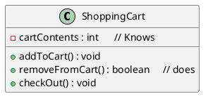
- Things an object knows about itself are called Instance Variable.They represent an object's state (the data),and can have unique values for each object of that type.
- Things an object can do are called Methods.
- When you design a class,you think about the data an object will need to know about itself,and you also design the methods that operate on that data.
- It's common for anaobject to have methods that read or write the values of the instance variables.

## What’s the difference between a class and an object?
- A class is not an object.(but it’s used to construct them).
- A class is a blurPrint for an object.
- It tells the vertual machine how to make an object of that particular type.
- Each object made from that class can have its own values for the instance variables of that class.

## Making your first object
So what does it take to create and use an Object? you need two classes. One class foe the type of object you want to use (Dog,AlarmClock,Television,etc.)and another class to test youe new class.The tester class is where ypu put the main method,and in that main() method you create and access objects of your new class type.

- 1 Write Your Class 
```java
class Dog {
 int size;        // instance variable 
 String breed;   // instance variable 
 String name;   // instance variable 

 void bark() {    // a Method
 System.out.println("Ruff! Ruff!");
 }
}
```
- 2 Write a tester (TestDrive) class
```java
class DogTestDrive {
 public static void main (String[] args) {
 // Dog test code goes here
 }
}
```
- 3 In your tester, make an object and access the object’s variables and methods .
```java
class DogTestDrive {
 public static void main (String[] args) {
 Dog d = new Dog();
 d.size = 40;  // to access an object data use a Dot Operator (.)
 d.bark();
 }
}
```

## Dot Operator (.)
The dot operator (.) gives you access to an object's state and behavior (instance variables and methods).
```java
// make a new object 
Dog d=new Dog();
// tell it to bark by using the dot operater on the variable d to call bark method 
d.bark();
// set its size using the dot operator 
d.size=40;
```

## Controlling your Dog object
You know how to declare a primitive variable and assign it a
value . But now what about non-primitive variables? In other
words, what about objects?
- There Is actually no such thing as an object variable.
- There's only an object reference variable.
- An object reference variable holds bits that represent a way to access an object.
- It doesn't hold the object Itsetf, but It holds something like a pointer. Or an address.
- You use the dot operator (.) on a reference variable 10 say, "use the thing before the dot to get me the thing afterthe dot." For example
```java
myDog.bark() ;
```
means, "use the object referenced by the variable myDog to invoke the bark() method." When you use the dot operator on an object reference variable, think of it like pressing a button on the remote control for that object.
- Think of a Dog reference variable as a Dog remote control you use it to get the object to be do something (invoke methods).

## An object referet1ce is just another variable value
Something that goes In a cup.Only this time, the value 15 a remote control.
- Primitive Variable :
    byte x = 7 ;
    this bits representing 7 go into variable.(00000111)
- Reference Variable :
    Dog myDog = new Doq() ;
    This bits representing a way yo get to the Dog object go into the variable .
    The Dog Object itself doesn't go into the variable .


## Making and testing Movie objects
```java
class Movie {
 String title;
 String genre;
 int rating;
 void playIt() {
 System.out.println(“Playing the movie”);
 }
}
public class MovieTestDrive {
 public static void main(String[] args) {
 Movie one = new Movie();
 one.title = "Gone with the Stock";
 one.genre = "Tragic";
 one.rating = -2;
 Movie two = new Movie();
 two.title = "Lost in Cubicle Space";
 two.genre = "Comedy";
 two.rating = 5;
 two.playIt();
 Movie three = new Movie();
 three.title = "Byte Club";
 three.genre = "Tragic but ultimately uplifting";
 three.rating = 127;
 }
}
```

## The two uses of main:
- to Test youe real class
- to Lunch/Start your java application 

## OOP Bullet Points 
- Object-oriented programming lets you extend 
a program without having to touch previously tested, working code.
- All Java code is defined in a class. 
- A class describes how to make an object of that class type. A class is like a blueprint .
- An object can take care of itself; you don’t have to know or care how the object does it.
- An object knows things and does things.
- Things an object knows about itself are called instance variables. They represent the state of an object.
- Things an object does are called methods. They represent the behavior of an object.
- When you create a class, you may also want to create a separate test class which you’ll use to create objects of your new class type.
- At runtime, a Java program is nothing more than objects ‘talking’ to other objects.


## Encapsulation In OOP
Encapsulation is one of the four fundamental Object-Oriented Programming (OOP) concepts, along with inheritance, polymorphism, and abstraction. In Java, encapsulation refers to the bundling of data (attributes or fields) and methods (functions or procedures) that operate on the data into a single unit known as a class. This unit provides a protective barrier, preventing the direct access to the internal details of the class from outside.

### Encapsulation serves several purposes in Java and OOP in general:
- *Data Hiding*: The internal details of a class, such as its data members, are hidden from the outside world. This means that the implementation details can change without affecting the code that uses the class.

- *Access Control*: By using access modifiers (like private, protected, and public), you can control the visibility of class members. For example, you can make certain variables private, allowing access only through getter and setter methods.

- *Modularity*: Encapsulation promotes modularity by organizing code into manageable units (classes). Each class is responsible for a specific set of functionalities, and changes to one class don't necessarily affect other parts of the program.

### Access Modifiers In Java
- *Default (Package-Private)*:
    No keyword is used for default access.
    Members with default access are accessible within the same package. They are not accessible outside the package.
    ```java
    class Example {
    int x;  // default access
    }
    ```
- *Private*:
    The private keyword is used to declare a member as private.
    Members with private access are only accessible within the same class. They are not accessible outside the class.    
    ```java
    class Example {
    private int x;
    }
    ```
- *Protected*:
    The protected keyword is used to declare a member as protected.
    Members with protected access are accessible within the same package and subclasses (even if they are in a different package). 
    ```java
    class Example {
    protected int x;
    }
    ```
- *Public*:
    The public keyword is used to declare a member as public.
    Members with public access are accessible from any part of the program, both within and outside the package.      
    ```java
    public class Example {
    public int x;
    }
    ```     

### How can i access private attribute outside a class
In Java, the private access modifier restricts the visibility of a class member (field, method, or inner class) to only within the same class. This means that you cannot access a private member directly from outside the class.
However, there are ways to access private members indirectly within the same class or through special mechanisms. Here are a few common ways to work with private members:  
- Access within the same class: You can access private members directly within the same class. Here's an example
```java
public class Car {
    private int price;

    public void accessPrice() {
        // Accessing private member within the same class
        price = 10;
        System.out.println("Private price: " + price);
    }
}
```

- Accessor (Getter) and Mutator (Setter) Methods:You can provide public methods (getters and setters) to access and modify private members
```java
public class Car {
    private int price;

    // Getter method to access privateVar
    public int getPrice() {
        return price;
    }

    // Setter method to modify privateVar
    public void setPrice(int value) {
        price = value;
    }
}
```
With these methods, you can indirectly access and modify the private member
```java
Car obj = new Car();
obj.setPrice(42);
int value = obj.getPrice();   // 42
```

- Reflection (Advanced):Java Reflection API allows you to inspect and manipulate classes, methods, fields, etc., at runtime. While it's a powerful mechanism, it should be used with caution because it can break encapsulation. Here's an example of accessing a private field using reflection:
```java
import java.lang.reflect.Field;

public class Car {
    private int price;

    public static void main(String[] args) throws NoSuchFieldException, IllegalAccessException {
        Car obj = new Car();
        
        // Using reflection to access private field
        Field field = Car.class.getDeclaredField("price");
        field.setAccessible(true);
        int value = (int) field.get(obj);

        System.out.println("Private variable: " + value);
    }
}
```
Keep in mind that using reflection to access private members goes against the principles of encapsulation and should be done with care. It might lead to code that is more fragile and harder to maintain.


### Benefits of Encapsulation in Java:
- *Security*:
Protects the internal state of an object from unauthorized access and modification.

- *Flexibility and Maintenance*:
Changes to the internal implementation of a class do not affect code that uses the class, promoting modularity and ease of maintenance.

- *Code Organization*:
Encapsulation helps organize code into manageable units (classes), improving the overall structure of a program.

- *Validation and Control*:
By using setters, you can enforce validation rules and control how data is modified.


### Example of Encapsulation in Java:
```java
public class BankAccount {
    private String accountNumber;
    private double balance;

    public BankAccount(String accountNumber) {
        this.accountNumber = accountNumber;
        this.balance = 0.0;
    }

    public double getBalance() {
        return balance;
    }

    public void deposit(double amount) {
        if (amount > 0) {
            balance += amount;
            System.out.println("Deposit successful. New balance: " + balance);
        } else {
            System.out.println("Invalid deposit amount.");
        }
    }

    public void withdraw(double amount) {
        if (amount > 0 && amount <= balance) {
            balance -= amount;
            System.out.println("Withdrawal successful. New balance: " + balance);
        } else {
            System.out.println("Invalid withdrawal amount.");
        }
    }
}

```


## Better Living in Objectville (inheritance and polymorphism)
- Plan your programs with the future in mind.If there were a way to write Java code such that you could take more vacations, how much would It be worth to you? What if you could write code that someone else could extend, easily? And if you could write code that was flexible, for those pesky last-minute spec changes, would that be something you're interested In?Then this is your lucky day.

### The power of inheritance :

- I looked at what all four classes have in common .

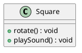

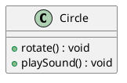

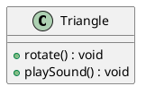

- There're Shapes, and they all rotate and plavSound. So I abstracted out the common features and put them into a new class called Shape.
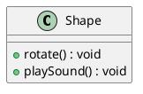

- Then i linked the other four shape classes tp the new shape class,in a relationship called inheritance .
*SuperClass*


*SubClasses*
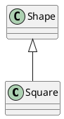

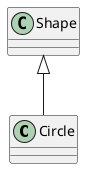

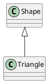

- You can read this as, "Square Inherits from Shape" ,"Circle Inherits from Shape", and so on. I removed rotate() and playSound() from the other shapes, so now there's only one copy to maintain.
- The.Shape class is called the Superclass of the other four classes. The other four are the subclasses of Shape. The Subclasses Inherit the methods of the superclass. In other words. If the Shape class has the functianality, then the subclasses automatically gat that same functionality .

#### Understanding Inheritance
- When you design with inheritance, you put common code in a class and then tell other more specific classes that the common (more abstract) class is their superclass.When one class inherits from another, the subclass inherits from the superclass.
- In Java, we say that the subclass extends the superclass. An inheritance relationship means that the subclass inherits the members of the superclass, When we say "members of a class" we mean the instance variables and methods .
- For example, if PantherMan is a subclass of SuperHero, the PantherMan class automatically inherits the instance variables and methods common to all superheroes including suit, tights specialPower, useSpecialPower() and so on.But the PantherMan subclass can add new methods and instance variables of its own, and it can override the methods it inherits fro:m the superclass SuperHero.

- *SuperClass*
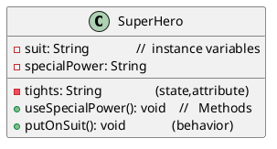

- *SubClasses*  
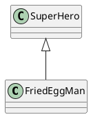
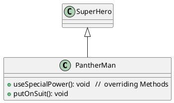

- FriedEggMan doesn't need any behavior that's unique,so he doesn't override any methods. The methods and instance variables in SuperHero are sufficient.PanthenMan, though, has specific requirements for his suit and special powers, so useSpecialPower () and putOnSuit () are both overridden in the PantherMan class.
- Instance variables are not overridden because they don't need to be. They don't define any special behavior, so a subclass can give an inherited instance variable any value it chooses.

#### An Inheritance example :
```java
public class Doctor{
    boolean worksAtHospital;
    void treatPatient(){
        // perform a checkup
    }
}

public class FamilyDoctor extends Doctor{
    boolean makeHouseCalls;
    void giveAdvice(){
        //give homespun advice
    }
}

public class Surgeon extends Doctor{
    void treatPatient(){
        // perform surgery
    } 
    void makeIncision(){
        //make incision (yikes!)
    }
}
```

#### Using IS-A and HAS-A
- Remember that when one class inherits from another, we say that the subclass extends the superclass. When you want to know if one thing should extend another, apply the IS-A test, Triangle IS-A Shape, yeah, that works. Cat IS-A Feline, that works too .Surgeon IS-A Doctor, still good.Tub extends Bathroom, sounds reasonable.
Until you apply the IS-A test.
- To know if you've designed your types correctly, ask, "Does it make sense to say type X IS-A type Y?" If it doesn't, you know there's something wrong with the design, so ifwe apply the IS-A test, Tub IS-A Bathroom is definitely false.
- What if we reverse it to Bathroom extends TUb? That still doesn't work.,Bathroom IS-AvTub doesn't work.
- Tub and Bathroom are related, but not through inheritance. Tub and Bathroom are joined by a HAS-A relationship. Does it make sense to say "Bathroom HAS-A TUb"? If yes, then it means that Bathroom has a Tub instance variable. In other words, Bathroom has a reference to a Tub, but Bathroom does not extend Tub and vice-versa.

#### But wait! There's More!
The IS-A test works anywhere in the inheritance tree. If your inheritance tree is well-designed, the IS-Atest should make sense when you ask any subclass if it IS-A any of it IS su pertypes.
- If class B extends class A, class B IS-A class A.This is true anywhere in the inheritance tree. If class C extends class B, class C passes the IS-A test for both B and A.

#### How do you know if you've got your inheritace right?
Keep in mind that the inheritance IS-A relationship works in only one directionl !
- Triangle IS-AShape makes sense, so you can have Triangle extend Shape. But the reverse-Shape IS-A Triangle-does not make sense, so Shape should not extend Triangle. Remember that the IS-A relationship implies that if X IS-A y. then X can do anything a Y can do (and possibly more).

#### Access levels control
- public members are Inherited
- private members are not Inherited

#### Inheritance Bullet Points
• A subclass extends a superclass.
• A subclass Inherits all public Instance variables and methods of the superclass, but does not Inherit the private Instance variables and methods of the superclass,
• Inherited methods can be overridden; instance variables cannot be overridden (although they can be redefined in the subclass, but that's not the same thing, and there's almost never a
need to do it)
• Use the IS-A test to verify that your inheritance hierarchy is valid. If X extends Y,then X IS-A Y must make sense.
• The IS-A relationship works In only one direction. A Hippo is an Animal. but not all Animals are Hippos.
• When a method is overridden ina subclass, and that method is Invoked on an instance of the subclass, the overridden version of the method is called. (The lowest one wins.)
• If class B extends A, and C extends B, class B IS-A class A, and class C IS-A class B, and class C also IS-A class A .

#### So what does all this Inheritance really buy you?
- You avoid duplicate code.Put common code in one place, and let the subclasses inherit that code from a superclass . When you want to change that behavior, you have to modify it in only one place,and everybody else (i.e, all the subclasses) see the change .
- You define a common protocol for a group of classes.


### The power of polymorphism
- With polymorphism, you can write code that doesn't have to change when you introduce new subclass types Into the program.
- It refers to the ability of a single function, method, or operator to operate on different types of data or objects. In other words, polymorphism allows objects of different types to be treated as objects of a common type.

#### Types of Polymorphism
1. *Compile-time (Static) Polymorphism*
- Method Overloading: Multiple methods in the same class with the same name but different parameter lists.
  ```java
  public class Calculator {
      public int add(int a, int b) {
          return a + b;
      }

      public double add(double a, double b) {
          return a + b;
      }
  }
  ```
2. *Run-time (Dynamic) Polymorphism*
- Method Overriding: A subclass provides a specific implementation of a method already defined in its superclass..
```java
 Superclass
public class Animal {
    public void makeSound() {
        System.out.println("Some generic sound");
    }
}

// Subclass
public class Dog extends Animal {
    @Override
    public void makeSound() {
        System.out.println("Woof! Woof!");
    }
}
  ```

#### Keepingg the contract: rules for overriding
When you override a method from a supercIass, you're agreeing to fulfill the contract. The contract that says. for example, I take no
arguments and I return a boolean. In other words, the arguments and return types of your overriding method must look to the outside world exactly like the overridden method in the superclass .
- Arguments must be the same, and return types must be compatible.
- The method can't be less accessible
  
#### Overloading a Method
Method overloading is nothing more than having two methods with the same name but different argument lists. Period. There's no polymorphism involved with overloaded methods!.It has nothing to do with inheritance and polymorphism. An overloaded method isNoT the same as an overridden method .
- The return types can be different.
- You can't change only the return type.
- You can vary the access levels in any direction.


